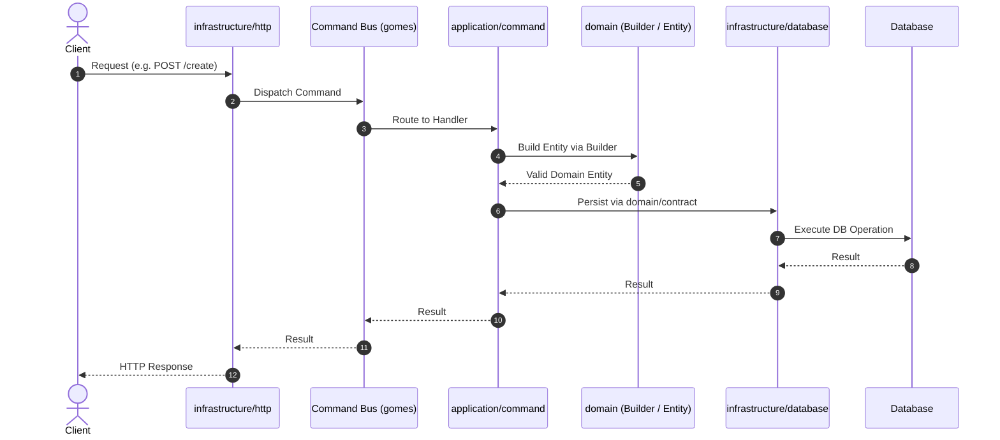

# DDD Module Knowledge Base

This skill provides the **reference knowledge** for how DDD modules are composed in this project.
It does not perform actions — it delivers the architectural context, conventions, and
implementation patterns that other skills or agents consume when working with modules.

## Scope

**This skill covers:**
- Module structure and layer boundaries (domain → application → infrastructure)
- Naming conventions per layer and component
- Implementation patterns with boilerplates and real code references
- Design decisions and architectural constraints

**This skill does NOT cover:**
- Unit test generation → use `make-unit-tests` skill
- Code formatting and GoDoc → use `adjust-go-code` skill
- Make or adjust code

## Module Architecture Overview

Each module lives under `internal/[module-name]/` and follows this structure:

```
internal/[module-name]/
├── domain/
│   ├── contract/
│   │   └── repository.go
│   │   └── [contract-type].go
│   ├── event/
│   │   └── [event_name].go
│   ├── [entity].go
│   └── builder.go
├── application/
│   ├── command/
│   │   └── [actionname]/
│   │       ├── command.go
│   │       └── handler.go
│   └── query/
│       └── [queryname]/
│           ├── query.go
│           └── handler.go
├── infrastructure/
│   ├── database/
│   │   ├── gorm_model.go
│   │   ├── gorm_[module]_repository.go
│   │   └── mapper.go
│   └── http/
│       └── [action_name]_handler.go
└── [module-name].go
```

### Request Flow



## Module Rules

- Modules must be created in the `internal/` folder
- Modules must be independent of each other (no cross-module imports)
- Modules must follow the same structure and naming conventions
- Infrastructure implementations must respect domain contracts (interfaces defined in `domain/contract/`)
- Each module must have a registration file (`[module-name].go`) at its root
- Modules must be registered in `cmd/api/main.go`

### Domain Layer Rules

- This layer is responsible **only** for business rules
- Must be independent — zero dependencies on application or infrastructure layers
- Aggregate root is the only entry point to the domain
- Aggregate root must use Builder pattern for construction
- Only aggregate root emits domain events
- Domain contracts (interfaces) must be defined in `domain/contract/`
- Domain events must be defined in `domain/event/`
- Uses the `ddgo` library for DDD primitives

### Application Layer Rules

- Responsible for orchestrating domain actions (glue between domain and infrastructure)
- Must be independent of infrastructure details (no HTTP contexts, no direct DB queries)
- Follows CQRS pattern: Commands (state-changing) separated from Queries (read-only)
- Each action (Command/Query) has its own dedicated directory
- `command.go` defines the DTO struct and implements `Name()` method
- `handler.go` implements the `Handle` method, interacting with domain aggregates and contracts
- Handlers map external DTOs into domain objects via the Builder

### Infrastructure Layer Rules

- Responsible only for implementation details (adapters)
- Must implement contracts defined in `domain/contract/`
- Must not contain business rules
- Database models (persistence models) must be separate structs from domain entities
- Mapper functions must be package-private, residing in the database package
- HTTP handlers dispatch through `gomes` bus — never call domain or repository directly
- Repository implementations must use transaction management for write operations
- Repository errors must be wrapped with `ddgo` error types
- HTTP handlers must use `pkg/http` helpers for standardized responses
- OpenTelemetry tracing must be initialized per handler using `gomes/otel`

## Naming Conventions

| Component | File Name | Struct/Type Name | Example |
|-----------|-----------|------------------|---------|
| Module directory | singular, lowercase | — | `user`, `pickuppoint` |
| Aggregate root | singular, snake_case | singular, PascalCase | `user.go` → `User` |
| Entity | singular, snake_case | singular, PascalCase | `person.go` → `Person` |
| Value Object | singular, snake_case | singular, PascalCase | `document.go` → `Document` |
| Builder | `builder.go` | `Builder` | — |
| Domain Event | singular, snake_case | singular, PascalCase | `user_created.go` → `UserCreated` |
| Domain Contract | singular, snake_case | singular, PascalCase | `user_repository.go` → `UserRepository` |
| Command dir | singular, lowercase, no separator | — | `createuser` |
| Command file | `command.go` | `Command` | — |
| Handler file | `handler.go` | `Handler` | — |
| Command `Name()` | — | camelCase string | `"createUser"` |
| Handler constructor | — | `NewCommandHandler` | — |
| Persistence model | `gorm_model.go` | plural, PascalCase | `Users`, `PersonContacts` |
| `TableName()` | — | `[project-name].[table]` | `hex-api-go.users` |
| Repository impl | `gorm_[module]_repository.go` | `Gorm[Module]Repository` | `GormUserRepository` |
| Repository constructor | — | `NewGorm[Module]Repository` | `NewGormUserRepository` |
| Mapper | `mapper.go` | unexported functions | `toDatabase`, `toDomain` |
| HTTP handler file | `[action_name]_handler.go` | `[ActionName]Handler` func | `CreateUserHandler` |
| HTTP request struct | in handler file | `[ActionName]Request` | `CreateUserRequest` |
| HTTP trace var | in handler file | `[actionName]Trace` | `createUserTrace` |
| Module registration | `[module-name].go` | `[moduleName]Module` | `userModule` |
| Module constructor | — | `New[ModuleName]Module` | `NewUserModule` |

## Errors Handling

Always use the errors from the `ddgo` package. Don't create new error types. 
The mapping between these errors and HTTP status codes is handled automatically by the `pkg/http` package.

| `ddgo` Error | Objective | When to use | HTTP Status |
|--------------|-----------|-------------|-------------|
| `ValidationError` | Indicate failures in payload/DTO structural validation | Use in application/infrastructure layers when incoming request data fails basic structural validation (e.g. required fields missing) | 400 Bad Request |
| `InvalidDataError` | Indicate domain-specific business rule validation failures | Use in domain entities, value objects, and builders when business invariants or domain validations fail | 422 Unprocessable Entity |
| `NotFoundError` | Indicate that a requested resource was not found | Use in repositories or application layers when a requested entity/aggregate root does not exist in the database | 404 Not Found |
| `AlreadyExistsError` | Indicate a conflict due to a resource already existing | Use in application layers or repositories when trying to create an entity that violates a unique constraint (e.g. user email already registered) | 409 Conflict |
| `DependencyError` | Indicate failures in external systems or downstream services | Use in infrastructure adapters when external APIs, message brokers, or third-party services fail to respond correctly | 502 Bad Gateway |
| `InternalError` | Indicate unexpected systemic failures | Use when unexpected errors occur, like database connection loss, internal panics, or marshaling errors | 500 Internal Server Error |

## Gotchas

- Aggregate root entity name **must** equal the module name (e.g., module `user` → entity `User`)
- **Only** the aggregate root uses the Builder pattern — child entities use `New[Entity]()` directly
- **Only** aggregate root entities emit domain events
- `TableName()` must follow the pattern `[project-name].[table_name]` (e.g., `hex-api-go.users`)
- HTTP handlers must **never** call domain or repository directly — always dispatch through the bus
- Builder's `buildErrors` slice must be initialized with `make([]string, 0, N)` in the constructor
- The `validate` function in entities is package-private (unexported) — each entity has its own
- Join table models do **not** embed `gorm.Model` — they use composite primary keys and explicit timestamp fields
- When using many-to-many with GORM, you must call `db.SetupJoinTable()` **before** `AutoMigrate`
- When using regex, prebuild the regex in a var (for performance)
- for the errors always use `ddgo` error types.
- Don`t violate the SOLID principles.
- Don`t violate the Hexagonal Architecture principles.
- Don`t violate the DDD principles.
- Existing domain contracts should not be altered unless the change is explicitly stated in the PRD or if the user requests the change.

## Layer Implementation Patterns

Consult the following references for detailed boilerplates and implementation examples per component.
Each reference includes the pattern description, a complete boilerplate, and a link to a real implementation in the codebase.

### Domain Layer
- Entity / Aggregate Root → see `references/domain/entity-pattern.md`
- Aggregate Root Builder → see `references/domain/builder-pattern.md`
- Value Objects → see `references/domain/value-object-pattern.md`
- Domain Events → see `references/domain/domain-event-pattern.md`
- Domain Contracts → see `references/domain/domain-contract-pattern.md`

### Application Layer
- Command DTO → see `references/application/command-pattern.md`
- Command Handler → see `references/application/command-handler-pattern.md`

### Infrastructure Layer
- HTTP Handler → see `references/infrastructure/http-handler-pattern.md`
- Repository Implementation → see `references/infrastructure/repository-pattern.md`
- Persistence Models (GORM) → see `references/infrastructure/persistence-model-pattern.md`
- Domain-Database Mapper → see `references/infrastructure/mapper-pattern.md`

### Module Bootstrap
- Module Registration → see `references/module/module-registration-pattern.md`

