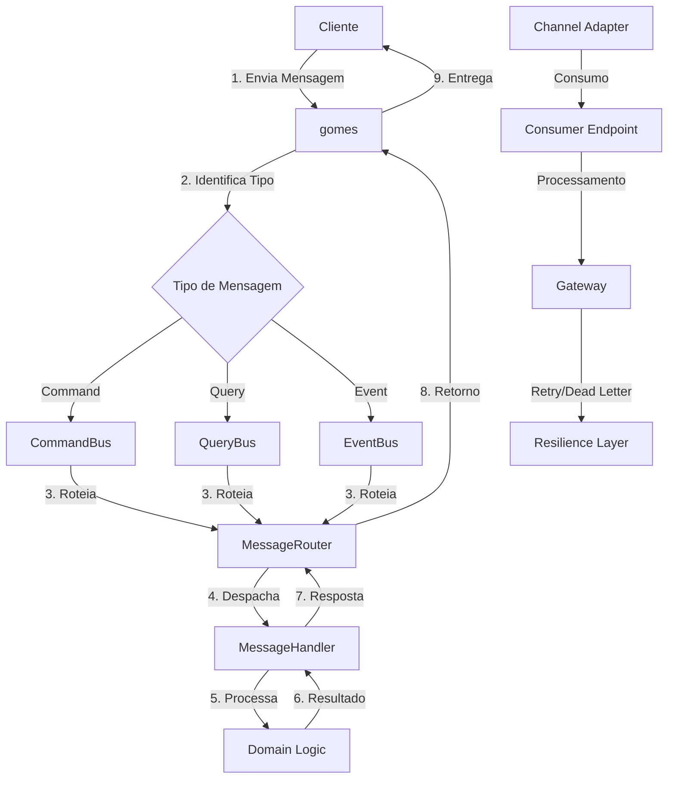
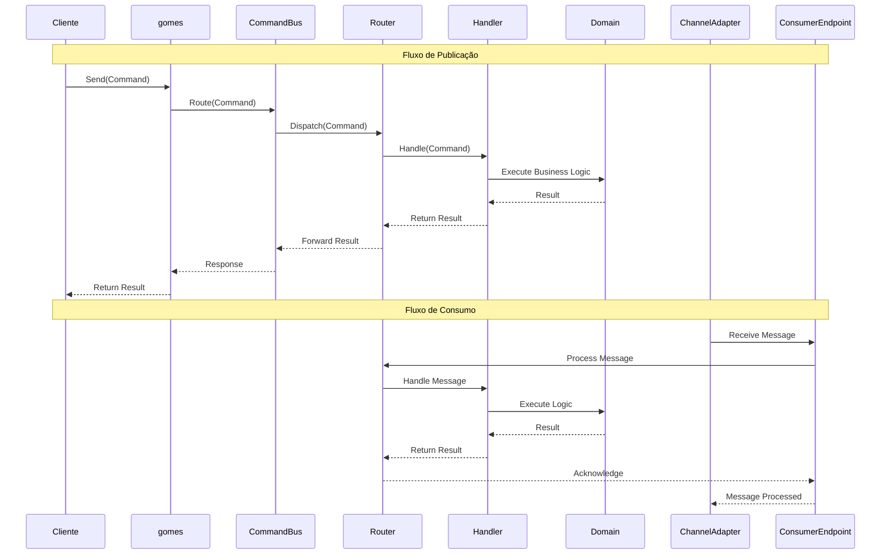
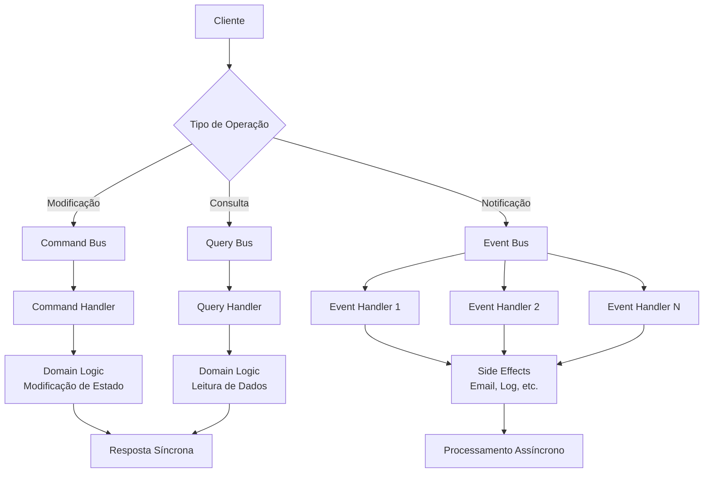
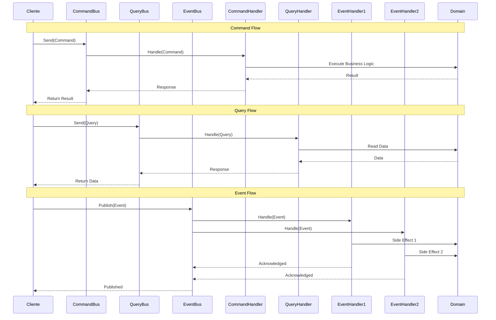
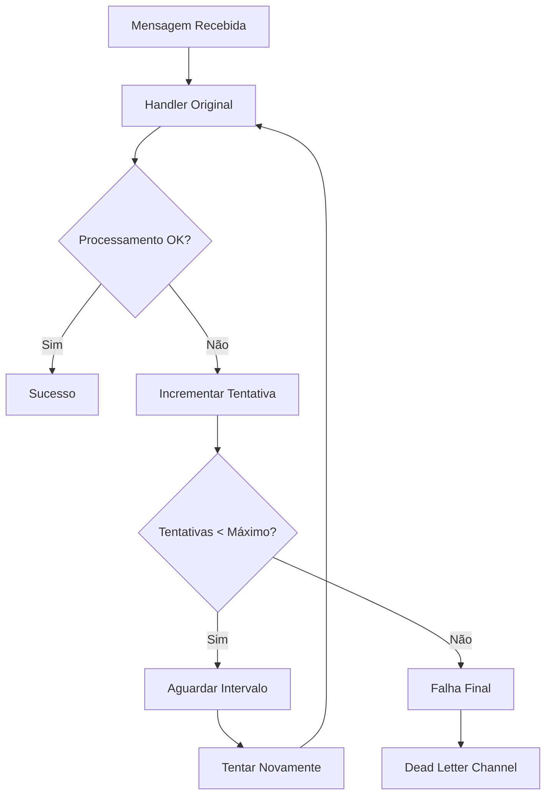
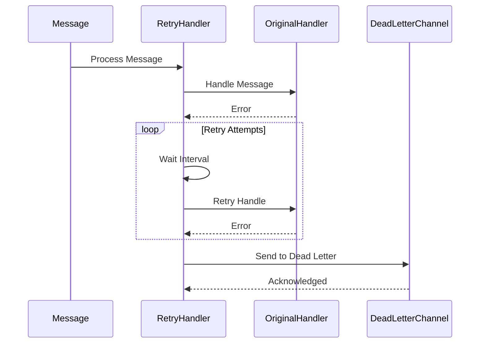
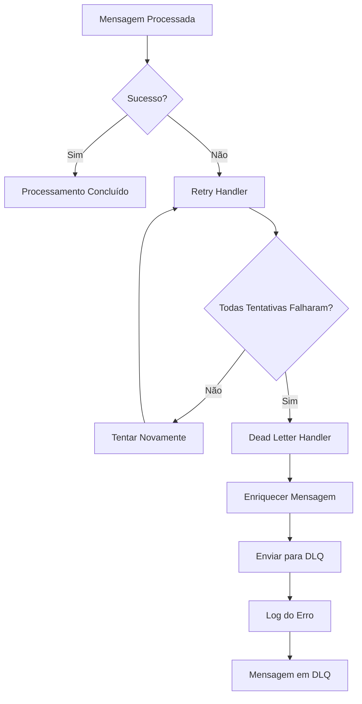
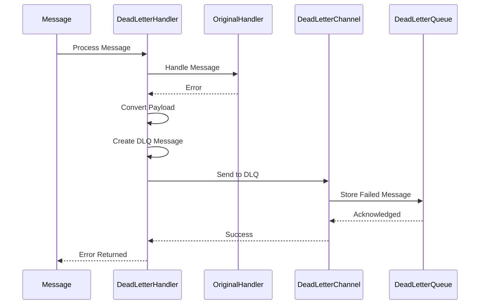

# 📦 gomes - Sistema de Mensagens para Arquitetura Hexagonal

## 📋 Índice

- [Visão Geral](#-visão-geral)
- [Bootstrap](#-bootstrap)
- [Componentes Principais](#-componentes-principais)
- [CQRS](#-cqrs)
- [Processamento Assíncrono](#-async-processing)
  - [Padrões de Publicação](#-padrões-de-publicação)
  - [Padrões de Consumo](#-padrões-de-consumo)
  - [Resiliência](#-resiliência)
  - [Kafka](#-kafka)

## 🎯 Visão Geral

O **gomes** é um plugin robusto e flexível para sistemas de mensagens em arquitetura hexagonal, implementando padrões de Enterprise Integration Patterns (EIP) e Command Query Responsibility Segregation (CQRS). Este sistema oferece uma abstração completa para comunicação assíncrona entre componentes, facilitando a construção de aplicações distribuídas e escaláveis.

### Características Principais

- **Arquitetura Hexagonal**: Separação clara entre domínio, aplicação e infraestrutura
- **Padrão CQRS**: Separação entre comandos (modificação) e queries (consulta)
- **Event-Driven Architecture**: Processamento assíncrono baseado em eventos
- **Enterprise Integration Patterns**: Implementação de padrões consolidados da indústria
- **Resiliência**: Suporte a retry automático e dead letter channels
- **Múltiplos Drivers**: Suporte a diferentes sistemas de mensagens (Kafka, RabbitMQ, etc.)
- **Processamento Paralelo**: Suporte a múltiplos processadores concorrentes

### Padrões e Abordagens Utilizadas

- **Message Channel**: Comunicação entre componentes através de canais
- **Message Router**: Roteamento inteligente de mensagens baseado em conteúdo
- **Dead Letter Channel**: Gerenciamento de mensagens que falharam no processamento
- **Message Dispatcher**: Distribuição de mensagens para handlers apropriados
- **Event-Driven Consumer**: Consumo assíncrono com processamento paralelo
- **Polling Consumer**: Consumo periódico para processamento em lote

### Estrutura de Pastas do Plugin

```
pkg/core/infrastructure/gomes/
├── bus/                    # Implementações CQRS
│   ├── command_bus.go      # Processamento de comandos
│   ├── query_bus.go        # Processamento de queries
│   └── event_bus.go        # Processamento de eventos
├── channel/                # Implementações de canais
│   ├── kafka/              # Driver Kafka
│   │   ├── connection.go   # Gerenciamento de conexões
│   │   ├── inbound_channel_adapter.go  # Consumo de mensagens
│   │   ├── outbound_channel_adapter.go # Publicação de mensagens
│   │   └── message_translator.go       # Tradução de mensagens
│   ├── pubsub_channel.go   # Canal publish-subscribe
│   └── point_to_point.go   # Canal point-to-point
├── container/              # Gerenciamento de dependências
│   └── generic_container.go
├── message/                # Core do sistema
│   ├── message.go          # Estrutura base de mensagens
│   ├── message_builder.go  # Builder para construção de mensagens
│   ├── channel/            # Canais de mensagens
│   ├── endpoint/           # Endpoints de processamento
│   │   ├── event_driven_consumer.go  # Consumer event-driven
│   │   ├── polling_consumer.go       # Consumer polling
│   │   ├── gateway.go                # Gateway de processamento
│   │   └── interfaces.go             # Interfaces dos endpoints
│   ├── handler/            # Handlers de mensagens
│   │   ├── dead_letter.go  # Handler para dead letter
│   │   └── retry_handler.go # Handler para retry
│   └── router/             # Roteamento de mensagens
└── message_system.go       # Entry point principal
```

## 🚀 Bootstrap

O Bootstrap é o processo de inicialização do gomes, onde todos os componentes são registrados e configurados antes do sistema começar a processar mensagens. Este processo é fundamental para garantir que o sistema funcione corretamente.

### Exemplo

```go
package main

import (
    "context"
    "log/slog"
    "os/signal"
    "syscall"
    "time"

    "github.com/jeffersonbrasilino/gomes"
    kafka "github.com/jeffersonbrasilino/gomes/channel/kafka"
)

func main() {
    // Configurar contexto para graceful shutdown
    ctx, stop := signal.NotifyContext(context.Background(), syscall.SIGINT, syscall.SIGTERM)
    defer stop()

    slog.Info("Iniciando gomes...")

    // 1. REGISTRAR HANDLERS
    // Registre todos os handlers de comandos, queries e eventos
    gomes.AddActionHandler(&CreateUserHandler{})
    gomes.AddActionHandler(&GetUserHandler{})
    gomes.AddActionHandler(&UserCreatedEventHandler{})

    // 2. CONFIGURAR CONEXÕES
    // Configure conexões com sistemas de mensagens (Kafka, RabbitMQ, etc.)
    gomes.AddChannelConnection(
        kafka.NewConnection("defaultConKafka", []string{"localhost:9093"}),
    )

    // 3. CONFIGURAR CANAIS DE PUBLICAÇÃO
    // Configure canais para envio de mensagens
    publisherChannel := kafka.NewPublisherChannelAdapterBuilder(
        "defaultConKafka",
        "gomes.topic",
    )
    gomes.AddPublisherChannel(publisherChannel)

    // Configure canal de Dead Letter Queue
    dlqPublisherChannel := kafka.NewPublisherChannelAdapterBuilder(
        "defaultConKafka",
        "gomes.dlq",
    )
    gomes.AddPublisherChannel(dlqPublisherChannel)

    // 4. CONFIGURAR CANAIS DE CONSUMO
    // Configure canais para recebimento de mensagens
    consumerChannel := kafka.NewConsumerChannelAdapterBuilder(
        "defaultConKafka",
        "gomes.topic",
        "test_consumer",
    )
    // Configure resiliência
    consumerChannel.WithRetryTimes(2_000, 3_000)
    consumerChannel.WithDeadLetterChannelName("gomes.dlq")

    gomes.AddConsumerChannel(consumerChannel)

    // 5. INICIAR O SISTEMA
    // Inicie o gomes - este passo é obrigatório
    gomes.Start()
    slog.Info("gomes iniciado com sucesso!")

    // 6. CONFIGURAR CONSUMERS
    // Configure e inicie os consumers
    consumer, err := gomes.EventDrivenConsumer("test_consumer")
    if err != nil {
        slog.Error("Erro ao criar consumer", "error", err)
        return
    }

    // Execute consumer com configurações específicas
    go consumer.WithAmountOfProcessors(2).
        WithMessageProcessingTimeout(30000).
        WithStopOnError(false).
        Run(ctx)

    // 7. SISTEMA OPERACIONAL
    // Aqui o sistema está pronto para processar mensagens
    slog.Info("Sistema operacional - processando mensagens...")

    // Exemplo de uso dos buses
    go publishMessages(ctx)

    // 8. GRACEFUL SHUTDOWN
    // Aguarde sinal de interrupção
    <-ctx.Done()
    slog.Info("Iniciando shutdown gracioso...")

    // Encerre o sistema graciosamente
    gomes.Shutdown()
    slog.Info("gomes encerrado com sucesso!")
}

func publishMessages(ctx context.Context) {
    ticker := time.NewTicker(5 * time.Second)
    defer ticker.Stop()

    for {
        select {
        case <-ctx.Done():
            return
        case <-ticker.C:
            // Publique comandos
            commandBus := gomes.CommandBusByChannel("gomes.topic")
            commandBus.SendAsync(ctx, &CreateUserCommand{
                Username: "user_" + time.Now().Format("20060102150405"),
                Password: "secure_password",
            })

            // Publique queries
            queryBus := gomes.QueryBusByChannel("gomes.topic")
            queryBus.SendAsync(ctx, &GetUserQuery{
                UserID: "123",
            })

            // Publique eventos
            eventBus := gomes.EventBusByChannel("gomes.topic")
            eventBus.Publish(ctx, &UserCreatedEvent{
                UserID:    "123",
                Username:  "john_doe",
                Timestamp: time.Now(),
            })
        }
    }
}
```

### Métodos de Bootstrap

#### Registro de Componentes

- **`AddActionHandler(handler)`**: Registra handlers de comandos, queries e eventos
- **`AddChannelConnection(connection)`**: Registra conexões com sistemas de mensagens
- **`AddPublisherChannel(channel)`**: Registra canais de publicação
- **`AddConsumerChannel(channel)`**: Registra canais de consumo

#### Controle do Sistema

- **`Start()`**: Inicia o gomes (obrigatório)
- **`Shutdown()`**: Encerra o sistema graciosamente
- **`ShowActiveEndpoints()`**: Mostra endpoints ativos para debug

### Boas Práticas de Bootstrap

1. **Ordem Importante**: Sempre registre handlers antes de iniciar o sistema
2. **Conexões Únicas**: Use o mesmo nome de conexão para reutilizar instâncias
3. **Graceful Shutdown**: Sempre configure graceful shutdown para produção
4. **Error Handling**: Trate erros durante a inicialização
5. **Logging**: Use logging adequado para monitorar o processo

## 🔧 Componentes Principais

### Diagrama de Fluxo



### Diagrama de Execução



## ⚡ CQRS

O gomes implementa o padrão **Command Query Responsibility Segregation (CQRS)** de forma nativa, separando claramente as operações de modificação (Commands) das operações de consulta (Queries), além de incluir o processamento de eventos (Events) para notificações assíncronas.

### Arquitetura CQRS no gomes



### Diagrama de Execução CQRS



### Implementação dos Buses

#### Command Bus

O Command Bus é responsável por processar comandos que modificam o estado do sistema. Cada comando tem exatamente um handler e retorna uma resposta síncrona.

```go
// Definição de um Command
type CreateUserCommand struct {
    Username string `json:"username"`
    Email    string `json:"email"`
    Password string `json:"password"`
}

func (c *CreateUserCommand) Name() string {
    return "CreateUser"
}

// Handler do Command
type CreateUserHandler struct {
    userRepository UserRepository
}

func (h *CreateUserHandler) Handle(ctx context.Context, cmd *CreateUserCommand) (*UserCreatedResult, error) {
    // Validação
    if cmd.Username == "" || cmd.Email == "" {
        return nil, errors.New("username and email are required")
    }

    // Criação do usuário
    user := &User{
        ID:       uuid.New().String(),
        Username: cmd.Username,
        Email:    cmd.Email,
        Password: hashPassword(cmd.Password),
    }

    // Persistência
    err := h.userRepository.Save(ctx, user)
    if err != nil {
        return nil, fmt.Errorf("failed to save user: %w", err)
    }

    // Retorno do resultado
    return &UserCreatedResult{
        UserID:   user.ID,
        Username: user.Username,
        Email:    user.Email,
    }, nil
}

// Uso do Command Bus
func createUser() {
    commandBus := gomes.CommandBus()

    result, err := commandBus.Send(context.Background(), &CreateUserCommand{
        Username: "john_doe",
        Email:    "john@example.com",
        Password: "secure_password",
    })

    if err != nil {
        log.Printf("Erro ao criar usuário: %v", err)
        return
    }

    log.Printf("Usuário criado: %+v", result)
}
```

#### Query Bus

O Query Bus é responsável por processar consultas que leem dados do sistema. Cada query tem exatamente um handler e retorna dados síncronos.

```go
// Definição de uma Query
type GetUserByIDQuery struct {
    UserID string `json:"user_id"`
}

func (q *GetUserByIDQuery) Name() string {
    return "GetUserByID"
}

// Handler da Query
type GetUserByIDHandler struct {
    userRepository UserRepository
}

func (h *GetUserByIDHandler) Handle(ctx context.Context, query *GetUserByIDQuery) (*User, error) {
    // Busca o usuário
    user, err := h.userRepository.FindByID(ctx, query.UserID)
    if err != nil {
        return nil, fmt.Errorf("failed to find user: %w", err)
    }

    if user == nil {
        return nil, errors.New("user not found")
    }

    // Retorna os dados (sem informações sensíveis)
    return &User{
        ID:       user.ID,
        Username: user.Username,
        Email:    user.Email,
        // Password não é retornado por segurança
    }, nil
}

// Uso do Query Bus
func getUser() {
    queryBus := gomes.QueryBus()

    user, err := queryBus.SendAsync(context.Background(), &GetUserByIDQuery{
        UserID: "123",
    })

    if err != nil {
        log.Printf("Erro ao buscar usuário: %v", err)
        return
    }

    log.Printf("Usuário encontrado: %+v", user)
}
```

#### Event Bus

O Event Bus é responsável por processar eventos que notificam sobre mudanças no sistema. Um evento pode ter múltiplos handlers e é processado de forma assíncrona.

```go
// Definição de um Event
type UserCreatedEvent struct {
    UserID    string    `json:"user_id"`
    Username  string    `json:"username"`
    Email     string    `json:"email"`
    Timestamp time.Time `json:"timestamp"`
}

func (e *UserCreatedEvent) Name() string {
    return "UserCreated"
}

// Handler 1: Envio de Email
type UserCreatedEmailHandler struct {
    emailService EmailService
}

func (h *UserCreatedEmailHandler) Handle(ctx context.Context, evt *UserCreatedEvent) error {
    // Enviar email de boas-vindas
    email := &Email{
        To:      evt.Email,
        Subject: "Bem-vindo!",
        Body:    fmt.Sprintf("Olá %s, sua conta foi criada com sucesso!", evt.Username),
    }

    return h.emailService.Send(ctx, email)
}

// Handler 2: Log de Auditoria
type UserCreatedAuditHandler struct {
    auditLogger AuditLogger
}

func (h *UserCreatedAuditHandler) Handle(ctx context.Context, evt *UserCreatedEvent) error {
    // Registrar no log de auditoria
    return h.auditLogger.Log(ctx, &AuditEntry{
        Action:    "USER_CREATED",
        UserID:    evt.UserID,
        Timestamp: evt.Timestamp,
        Details:   fmt.Sprintf("User %s created with email %s", evt.Username, evt.Email),
    })
}

// Handler 3: Notificação Push
type UserCreatedNotificationHandler struct {
    notificationService NotificationService
}

func (h *UserCreatedNotificationHandler) Handle(ctx context.Context, evt *UserCreatedEvent) error {
    // Enviar notificação push
    notification := &Notification{
        UserID:  evt.UserID,
        Title:   "Conta Criada",
        Message: "Sua conta foi criada com sucesso!",
        Type:    "SUCCESS",
    }

    return h.notificationService.Send(ctx, notification)
}

// Uso do Event Bus
func publishUserCreated(user *User) {
    eventBus := gomes.EventBus()

    err := eventBus.Publish(context.Background(), &UserCreatedEvent{
        UserID:    user.ID,
        Username:  user.Username,
        Email:     user.Email,
        Timestamp: time.Now(),
    })

    if err != nil {
        log.Printf("Erro ao publicar evento: %v", err)
    }
}
```

### Benefícios da Implementação CQRS

1. **Separação de Responsabilidades**: Commands modificam, Queries leem, Events notificam
2. **Escalabilidade Independente**: Cada tipo pode ser escalado separadamente
3. **Otimização de Performance**: Queries podem usar views otimizadas
4. **Flexibilidade**: Handlers podem ser adicionados/removidos independentemente
5. **Testabilidade**: Cada handler pode ser testado isoladamente
6. **Manutenibilidade**: Código mais organizado e fácil de manter

### Métodos dos Buses

#### Command Bus

- **`SendAsync(ctx, command)`**: Envia comando de forma assíncrona
- **`SendRawAsync(ctx, route, payload, headers)`**: Envia comando com payload e headers customizados

#### Query Bus

- **`SendAsync(ctx, query)`**: Envia query de forma assíncrona
- **`SendRawAsync(ctx, route, payload, headers)`**: Envia query com payload customizado e headers customizados

#### Event Bus

- **`Publish(ctx, event)`**: Publica evento de forma assíncrona
- **`PublishRaw(ctx, route, payload, headers)`**: Publica evento com payload customizado e headers customizados

## ⏱ Processamento assíncrono

### 📤 Padrões de Publicação

#### Comandos

Os comandos representam ações que modificam o estado do sistema. Eles são processados de forma síncrona e devem retornar uma resposta.

##### Exemplo de Uso

```go
// 1. Defina seu comando
type CreateUserCommand struct {
    Username string `json:"username"`
    Password string `json:"password"`
}

func (c *CreateUserCommand) Name() string {
    return "createUser"
}

// 2. Implemente o handler
type CreateUserHandler struct{}

func (h *CreateUserHandler) Handle(ctx context.Context, cmd *CreateUserCommand) (*ResultCm, error) {
    // Implemente a lógica de negócio
    fmt.Println("process command ok")
    return &ResultCm{"User created successfully"}, nil
}

// 3. Configure e use o sistema
func main() {
    // Configure conexão Kafka
    gomes.AddChannelConnection(
        kafka.NewConnection("defaultConKafka", []string{"localhost:9093"}),
    )

    // Configure canal de publicação
    publisherChannel := kafka.NewPublisherChannelAdapterBuilder(
        "defaultConKafka",
        "gomes.topic",
    )
    gomes.AddPublisherChannel(publisherChannel)

    // Registre o handler
    gomes.AddActionHandler(&CreateUserHandler{})

    // Inicie o sistema
    gomes.Start()

    // Use o command bus
    commandBus := gomes.CommandBusByChannel("gomes.topic")
    commandBus.SendAsync(context.Background(), &CreateUserCommand{
        Username: "teste",
        Password: "123",
    })
}
```

##### Métodos do Fluxo de Comando

- **`SendAsync(ctx, command)`**: Envia comando de forma assíncrona
- **`SendRawAsync(ctx, route, payload, headers)`**: Envia comando com payload customizado
- **`Handle(ctx, command)`**: Processa o comando no handler
- **`Route(command)`**: Roteia o comando para o handler apropriado

#### Queries

As queries representam consultas que não modificam o estado do sistema. Elas são processadas de forma síncrona e retornam dados.

##### Exemplo de Uso

```go
// 1. Defina sua query
type GetUserQuery struct {
    UserID string `json:"user_id"`
}

func (q *GetUserQuery) Name() string {
    return "getUser"
}

// 2. Implemente o handler
type GetUserHandler struct{}

func (h *GetUserHandler) Handle(ctx context.Context, query *GetUserQuery) (*User, error) {
    // Implemente a lógica de consulta
    return &User{ID: query.UserID, Name: "John Doe"}, nil
}

// 3. Use o query bus
func getUser() {
    queryBus := gomes.QueryBusByChannel("gomes.topic")
    user, err := queryBus.SendAsync(context.Background(), &GetUserQuery{
        UserID: "123",
    })
}
```

##### Métodos do Fluxo de Query

- **`SendAsync(ctx, query)`**: Envia query de forma assíncrona
- **`SendRawAsync(ctx, route, payload, headers)`**: Envia query com payload customizado
- **`Handle(ctx, query)`**: Processa a query no handler
- **`Route(query)`**: Roteia a query para o handler apropriado

#### Eventos

Os eventos representam notificações sobre mudanças no sistema. Eles são processados de forma assíncrona e podem ter múltiplos handlers.

##### Exemplo de Uso

```go
// 1. Defina seu evento
type UserCreatedEvent struct {
    UserID    string    `json:"user_id"`
    Username  string    `json:"username"`
    Timestamp time.Time `json:"timestamp"`
}

func (e *UserCreatedEvent) Name() string {
    return "userCreated"
}

// 2. Implemente handlers do evento
type EmailNotificationHandler struct{}

func (h *EmailNotificationHandler) Handle(ctx context.Context, evt *UserCreatedEvent) error {
    // Enviar email de boas-vindas
    fmt.Printf("Sending welcome email to user %s\n", evt.Username)
    return nil
}

type AuditLogHandler struct{}

func (h *AuditLogHandler) Handle(ctx context.Context, evt *UserCreatedEvent) error {
    // Registrar no log de auditoria
    fmt.Printf("Audit log: User %s created at %s\n", evt.Username, evt.Timestamp)
    return nil
}

// 3. Use o event bus
func publishUserCreated() {
    eventBus := gomes.EventBusByChannel("gomes.topic")
    eventBus.Publish(context.Background(), &UserCreatedEvent{
        UserID:    "123",
        Username:  "john_doe",
        Timestamp: time.Now(),
    })
}
```

##### Métodos do Fluxo de Evento

- **`Publish(ctx, event)`**: Publica evento de forma assíncrona
- **`PublishRaw(ctx, route, payload, headers)`**: Publica evento com payload customizado
- **`Handle(ctx, event)`**: Processa o evento em todos os handlers registrados
- **`Route(event)`**: Roteia o evento para todos os handlers apropriados

### 📥 Padrões de Consumo

#### Event-Driven Consumer

O Event-Driven Consumer processa mensagens de forma assíncrona e em tempo real, ideal para sistemas que precisam de baixa latência e alta throughput.

##### Características

- **Processamento Assíncrono**: Mensagens são processadas assim que chegam
- **Múltiplos Processadores**: Suporte a processamento paralelo
- **Baixa Latência**: Processamento imediato das mensagens
- **Alto Throughput**: Capacidade de processar muitas mensagens simultaneamente

##### Exemplo de Uso

```go
func main() {
    // Configure conexão e canais
    gomes.AddChannelConnection(
        kafka.NewConnection("defaultConKafka", []string{"localhost:9093"}),
    )

    // Configure consumer channel com resiliência
    topicConsumerChannel := kafka.NewConsumerChannelAdapterBuilder(
        "defaultConKafka",
        "gomes.topic",
        "test_consumer",
    )
    topicConsumerChannel.WithRetryTimes(2_000, 3_000)
    topicConsumerChannel.WithDeadLetterChannelName("gomes.dlq")

    // Registre canais e handlers
    gomes.AddConsumerChannel(topicConsumerChannel)
    gomes.AddActionHandler(&CreateUserHandler{})

    // Inicie o sistema
    gomes.Start()

    // Configure event-driven consumer
    consumer, err := gomes.EventDrivenConsumer("test_consumer")
    if err != nil {
        panic(err)
    }

    // Execute com configurações específicas
    go consumer.WithAmountOfProcessors(1).
        WithMessageProcessingTimeout(50000).
        WithStopOnError(false).
        Run(ctx)
}
```

##### Métodos do Event-Driven Consumer

- **`WithAmountOfProcessors(count)`**: Define número de processadores paralelos
- **`WithMessageProcessingTimeout(timeout)`**: Define timeout para processamento
- **`WithStopOnError(stop)`**: Define se deve parar em caso de erro
- **`Run(ctx)`**: Inicia o processamento assíncrono

#### Polling Consumer

O Polling Consumer processa mensagens de forma periódica, ideal para processamento em lote e sistemas que não precisam de tempo real.

##### Características

- **Processamento Periódico**: Verifica mensagens em intervalos definidos
- **Processamento em Lote**: Ideal para operações que processam múltiplas mensagens
- **Controle de Recursos**: Menor uso de recursos do sistema
- **Maior Latência**: Processamento não é imediato

##### Exemplo de Uso

```go
func main() {
    // Configure consumer polling
    consumer := gomes.NewPollingConsumer("batch-consumer")

    // Configure parâmetros
    consumer.WithPollIntervalMilliseconds(5000)      // Poll a cada 5 segundos
    consumer.WithProcessingDelayMilliseconds(1000)  // Delay de 1 segundo entre processamentos
    consumer.WithProcessingTimeoutMilliseconds(30000) // Timeout de 30 segundos
    consumer.WithStopOnError(false)                  // Não parar em caso de erro

    // Inicie o polling
    go consumer.Run(ctx)
}
```

##### Métodos do Polling Consumer

- **`WithPollIntervalMilliseconds(interval)`**: Define intervalo de polling
- **`WithProcessingDelayMilliseconds(delay)`**: Define delay entre processamentos
- **`WithProcessingTimeoutMilliseconds(timeout)`**: Define timeout para processamento
- **`WithStopOnError(stop)`**: Define se deve parar em caso de erro
- **`Run(ctx)`**: Inicia o polling periódico

#### Comparação: Event-Driven vs Polling

| Aspecto             | Event-Driven          | Polling                      |
| ------------------- | --------------------- | ---------------------------- |
| **Latência**        | Baixa (tempo real)    | Alta (periódica)             |
| **Throughput**      | Alto                  | Médio                        |
| **Uso de Recursos** | Alto                  | Baixo                        |
| **Complexidade**    | Média                 | Baixa                        |
| **Escalabilidade**  | Excelente             | Boa                          |
| **Casos de Uso**    | Tempo real, streaming | Batch processing, relatórios |

##### Prós e Contras

**Event-Driven Consumer:**

✅ **Prós:**

- Processamento em tempo real
- Alta eficiência para streaming
- Escalabilidade horizontal
- Baixa latência

❌ **Contras:**

- Maior complexidade de configuração
- Maior uso de recursos
- Pode causar backpressure se não configurado adequadamente

**Polling Consumer:**

✅ **Prós:**

- Simplicidade de implementação
- Baixo uso de recursos
- Controle preciso sobre quando processar
- Ideal para batch processing

❌ **Contras:**

- Maior latência
- Menor throughput
- Pode perder mensagens se o intervalo for muito longo

### 🛡️ Resiliência

#### Retry Pattern

O padrão de retry permite que o sistema tente processar uma mensagem novamente em caso de falha temporária, aumentando a robustez do sistema.

##### Como Funciona

O sistema implementa um handler de retry que envolve o handler original e tenta reprocessar a mensagem em caso de erro, com intervalos configuráveis entre as tentativas.

##### Diagrama de Fluxo do Retry



##### Diagrama de Execução do Retry



##### Exemplo de Configuração

```go
// Configure retry com intervalos específicos
topicConsumerChannel := kafka.NewConsumerChannelAdapterBuilder(
    "defaultConKafka",
    "gomes.topic",
    "test_consumer",
)

// Configure retry: [2000ms, 3000ms] - duas tentativas com intervalos de 2s e 3s
topicConsumerChannel.WithRetryTimes(2_000, 3_000)

// Configure dead letter channel
topicConsumerChannel.WithDeadLetterChannelName("gomes.dlq")
```

##### Métodos do Retry Handler

- **`NewRetryHandler(attemptsTime, handler)`**: Cria handler com tentativas configuradas
- **`Handle(ctx, msg)`**: Processa mensagem com retry automático
- **`WithRetryTimes(intervals...)`**: Configura intervalos de retry no consumer

#### Dead Letter Channel

O Dead Letter Channel é um padrão que captura mensagens que falharam no processamento após todas as tentativas de retry, permitindo análise posterior e recuperação manual.

##### Como Funciona

Quando uma mensagem falha após todas as tentativas de retry, ela é enviada para um canal especial (Dead Letter Channel) com informações sobre o erro e o payload original.

##### Diagrama de Fluxo do Dead Letter



##### Diagrama de Execução do Dead Letter



##### Exemplo de Configuração

```go
// 1. Configure canal de dead letter
publisherDlqChannel := kafka.NewPublisherChannelAdapterBuilder(
    "defaultConKafka",
    "gomes.dlq",
)

// 2. Registre o canal de dead letter
gomes.AddPublisherChannel(publisherDlqChannel)

// 3. Configure consumer com dead letter
topicConsumerChannel := kafka.NewConsumerChannelAdapterBuilder(
    "defaultConKafka",
    "gomes.topic",
    "test_consumer",
)
topicConsumerChannel.WithDeadLetterChannelName("gomes.dlq")
```

##### Estrutura da Mensagem Dead Letter

```go
type DeadLetterMessage struct {
    ReasonError string                 `json:"reason_error"`
    Payload     any                    `json:"payload"`
    Headers     map[string]string      `json:"headers"`
}
```

##### Métodos do Dead Letter Handler

- **`NewDeadLetter(channel, handler)`**: Cria handler com dead letter
- **`Handle(ctx, msg)`**: Processa mensagem e envia para DLQ em caso de erro
- **`convertMessagePayload(msg)`**: Converte payload para formato DLQ
- **`makeDeadLetterMessage(ctx, msg, payload)`**: Cria mensagem DLQ enriquecida

### 🚀 Kafka

O driver Kafka implementa a integração completa com Apache Kafka, fornecendo adaptadores para publicação e consumo de mensagens com suporte a todas as funcionalidades do gomes.

#### Configuração da Conexão

##### Exemplo de Configuração Básica

```go
// Crie uma conexão Kafka (singleton pattern)
connection := kafka.NewConnection("defaultConKafka", []string{"localhost:9093"})

// Registre a conexão no sistema
gomes.AddChannelConnection(connection)

// Conecte ao Kafka
err := connection.Connect()
if err != nil {
    log.Fatal("Failed to connect to Kafka:", err)
}
```

##### Configurações Avançadas

```go
// Configuração com múltiplos brokers
connection := kafka.NewConnection(
    "production-kafka",
    []string{
        "kafka1.example.com:9092",
        "kafka2.example.com:9092",
        "kafka3.example.com:9092",
    },
)
```

#### Publisher Channel (Publicação)

##### Configuração do Publisher

```go
// Crie um publisher channel
publisherChannel := kafka.NewPublisherChannelAdapterBuilder(
    "defaultConKafka",        // Nome da conexão
    "gomes.topic",     // Tópico de destino
)

// Registre o canal
gomes.AddPublisherChannel(publisherChannel)

// Use o canal através dos buses
commandBus := gomes.CommandBusByChannel("gomes.topic")
queryBus := gomes.QueryBusByChannel("gomes.topic")
eventBus := gomes.EventBusByChannel("gomes.topic")
```

##### Tradução de Mensagens

O sistema automaticamente traduz mensagens internas para o formato Kafka:

```go
// Mensagem interna
message := message.NewMessageBuilder().
    WithMessageType(message.Command).
    WithPayload(CreateUserCommand{Username: "john", Password: "123"}).
    WithHeaders(map[string]string{"correlationId": "123"}).
    Build()

// Tradução automática para Kafka
kafkaMessage := translator.FromMessage(message)
// Resultado: kafka.Message com headers e payload JSON
```

#### Consumer Channel (Consumo)

##### Configuração do Consumer

```go
// Crie um consumer channel
consumerChannel := kafka.NewConsumerChannelAdapterBuilder(
    "defaultConKafka",        // Nome da conexão
    "gomes.topic",    // Tópico de origem
    "test_consumer",         // Nome do consumer group
)

// Configure resiliência
consumerChannel.WithRetryTimes(2_000, 3_000)  // Retry com intervalos
consumerChannel.WithDeadLetterChannelName("gomes.dlq")  // DLQ

// Registre o canal
gomes.AddConsumerChannel(consumerChannel)
```

##### Configurações do Consumer

```go
// Configurações avançadas do consumer
consumerConfig := &kafka.ReaderConfig{
    Brokers:  []string{"localhost:9093"},
    Topic:    "gomes.topic",
    GroupID:  "test_consumer",
    MaxBytes: 10e6,  // 10MB por mensagem
}
```

#### Gerenciamento de Conexões

##### Singleton Pattern

O driver Kafka usa singleton pattern para reutilizar conexões:

```go
// Primeira chamada cria a conexão
conn1 := kafka.NewConnection("defaultConKafka", []string{"localhost:9093"})

// Segunda chamada retorna a mesma instância
conn2 := kafka.NewConnection("defaultConKafka", []string{"localhost:9093"})

// conn1 == conn2 (mesma instância)
```

##### Métodos da Conexão

- **`Connect()`**: Estabelece conexões com brokers Kafka
- **`Producer()`**: Retorna instância do producer Kafka
- **`Consumer(topic, groupId)`**: Cria consumer para tópico específico
- **`Disconnect()`**: Fecha conexões e libera recursos
- **`ReferenceName()`**: Retorna nome de referência da conexão

#### Tradução de Mensagens

##### FromMessage (Interna → Kafka)

```go
func (m *MessageTranslator) FromMessage(msg *message.Message) *kafka.Message {
    // Serializa headers
    headers := make([]kafka.Header, 0)
    for key, value := range msg.GetHeaders().ToMap() {
        headers = append(headers, kafka.Header{
            Key:   key,
            Value: []byte(value),
        })
    }

    // Serializa payload
    payload, _ := json.Marshal(msg.GetPayload())

    return &kafka.Message{
        Topic:   msg.GetHeaders().ChannelName,
        Key:     []byte(msg.GetHeaders().MessageId),
        Value:   payload,
        Headers: headers,
        Time:    time.Now(),
    }
}
```

##### ToMessage (Kafka → Interna)

```go
func (m *MessageTranslator) ToMessage(kafkaMsg *kafka.Message) *message.Message {
    // Converte headers Kafka para headers internos
    headers := make(map[string]string)
    for _, header := range kafkaMsg.Headers {
        headers[header.Key] = string(header.Value)
    }

    // Cria mensagem interna
    return message.NewMessageBuilder().
        WithPayload(kafkaMsg.Value).
        WithHeaders(headers).
        WithChannelName(kafkaMsg.Topic).
        Build()
}
```

#### Exemplo Completo de Uso

```go
func main() {
    ctx, cancel := context.WithCancel(context.Background())
    defer cancel()

    // 1. Configure conexão Kafka
    gomes.AddChannelConnection(
        kafka.NewConnection("defaultConKafka", []string{"localhost:9093"}),
    )

    // 2. Configure publisher
    publisherChannel := kafka.NewPublisherChannelAdapterBuilder(
        "defaultConKafka",
        "gomes.topic",
    )
    gomes.AddPublisherChannel(publisherChannel)

    // 3. Configure DLQ publisher
    dlqPublisherChannel := kafka.NewPublisherChannelAdapterBuilder(
        "defaultConKafka",
        "gomes.dlq",
    )
    gomes.AddPublisherChannel(dlqPublisherChannel)

    // 4. Configure consumer com resiliência
    consumerChannel := kafka.NewConsumerChannelAdapterBuilder(
        "defaultConKafka",
        "gomes.topic",
        "test_consumer",
    )
    consumerChannel.WithRetryTimes(2_000, 3_000)
    consumerChannel.WithDeadLetterChannelName("gomes.dlq")

    gomes.AddConsumerChannel(consumerChannel)

    // 5. Registre handlers
    gomes.AddActionHandler(&CreateUserHandler{})

    // 6. Inicie o sistema
    gomes.Start()

    // 7. Configure event-driven consumer
    consumer, err := gomes.EventDrivenConsumer("test_consumer")
    if err != nil {
        panic(err)
    }

    // 8. Execute consumer
    go consumer.WithAmountOfProcessors(2).
        WithMessageProcessingTimeout(30000).
        WithStopOnError(false).
        Run(ctx)

    // 9. Publique mensagens
    commandBus := gomes.CommandBusByChannel("gomes.topic")
    commandBus.SendAsync(ctx, &CreateUserCommand{
        Username: "john_doe",
        Password: "secure_password",
    })

    // 10. Graceful shutdown
    <-ctx.Done()
    gomes.Shutdown()
}
```

### Considerações de Performance

- **Connection Pooling**: Reutilização de conexões para melhor performance
- **Batch Processing**: Suporte a processamento em lote
- **Compression**: Compressão automática de mensagens grandes
- **Partitioning**: Distribuição automática por partições
- **Offset Management**: Gerenciamento automático de offsets

### Monitoramento e Debug

```go
// Visualize conexões ativas
gomes.ShowActiveEndpoints()

// Saída exemplo:
// ---[Message System] Active Endpoints ---
// Endpoint Name                  | Type
// -------------------------------------------
// gomes.topic            | [outbound] Command-Bus
// gomes.topic            | [outbound] Query-Bus
// gomes.topic            | [outbound] Event-Bus
// gomes.topic            | [inbound] Event-Driven
// gomes.dlq              | [outbound] Dead-Letter
```

---

> 💡 **Nota**: Esta documentação é um guia completo para desenvolvedores que desejam utilizar o gomes em suas aplicações. O sistema foi projetado para ser intuitivo para desenvolvedores júnior, mas poderoso o suficiente para cenários complexos de produção.
