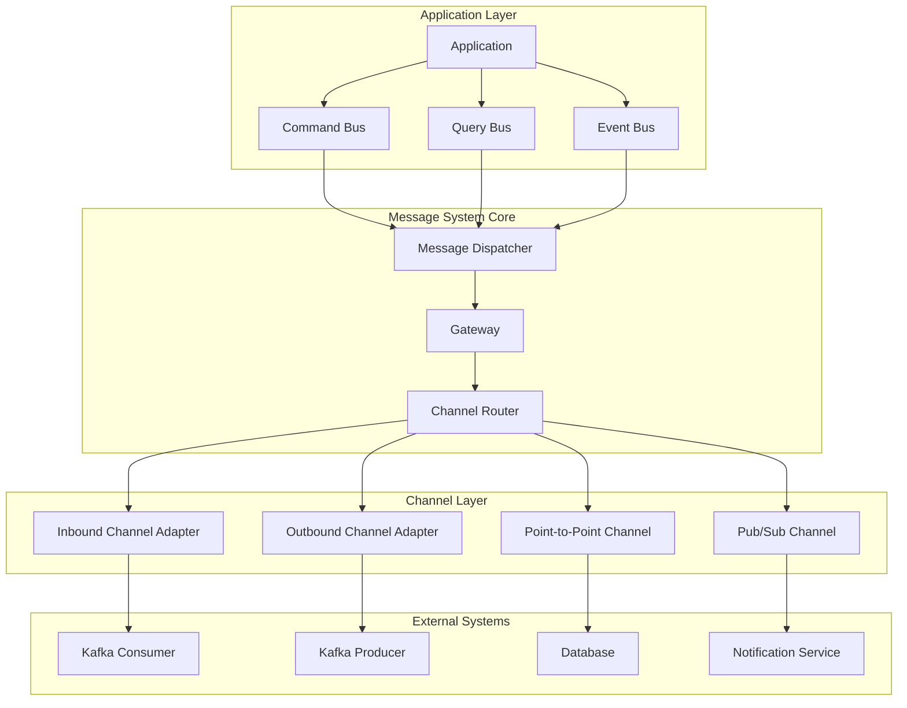
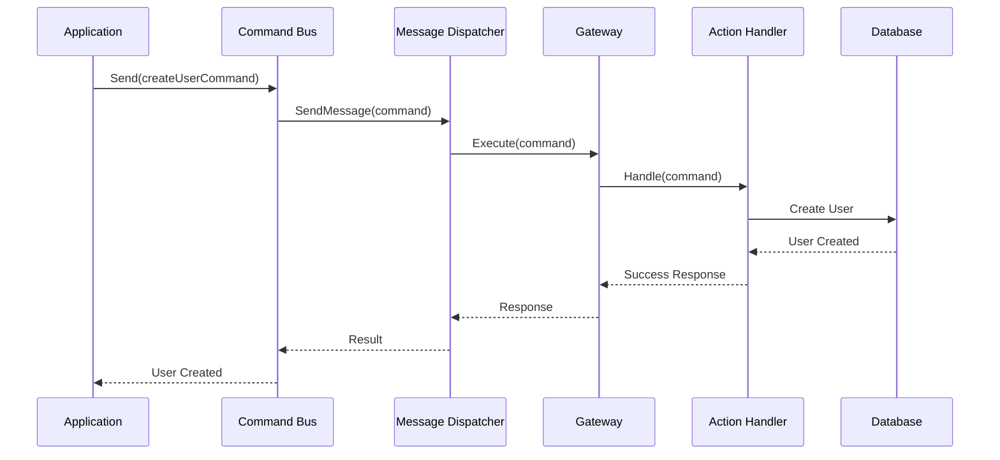
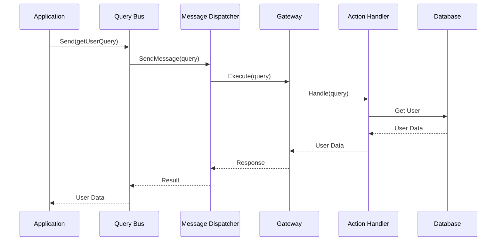
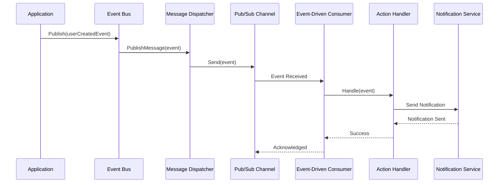
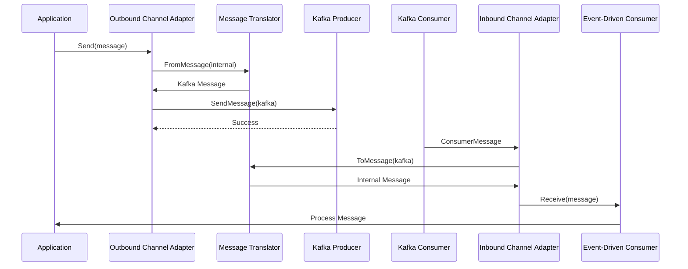
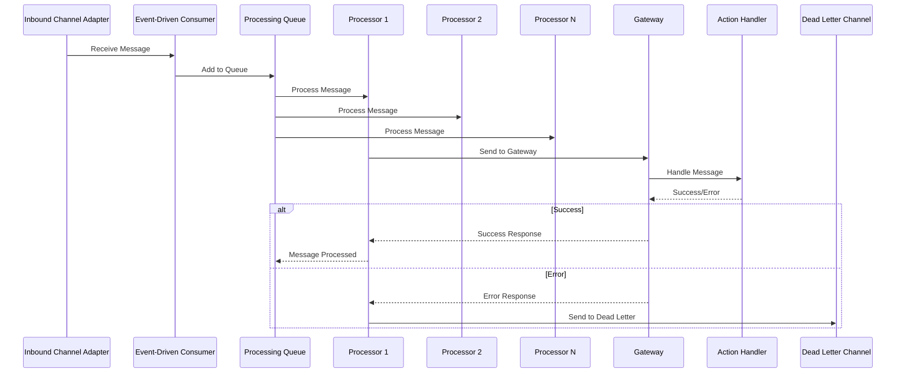
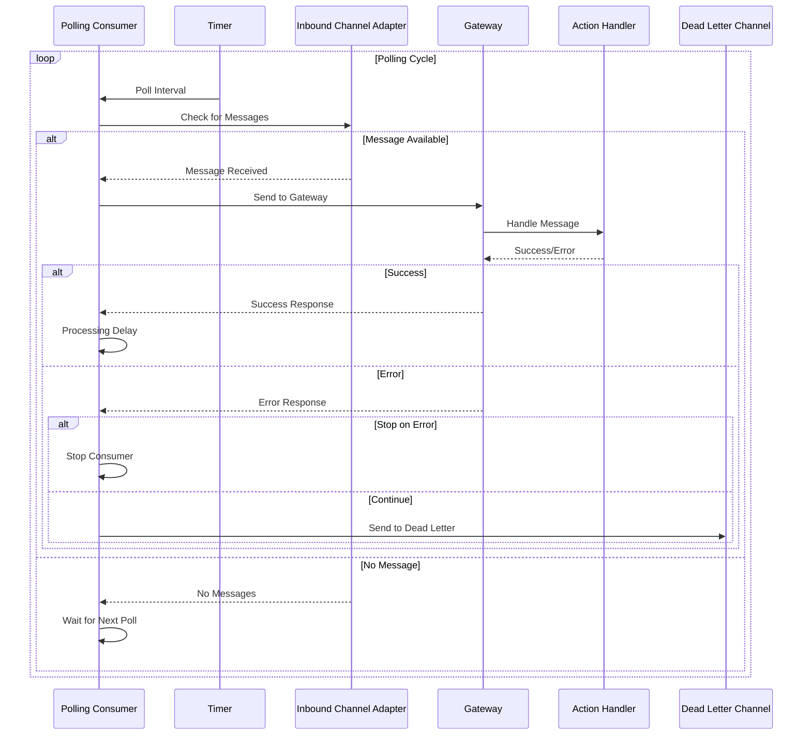
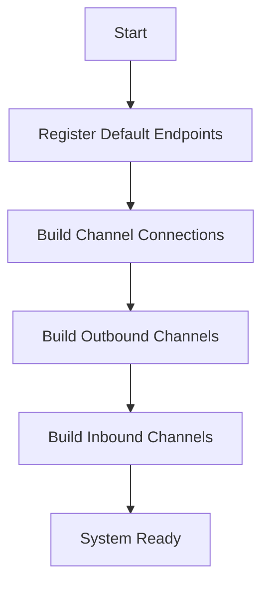
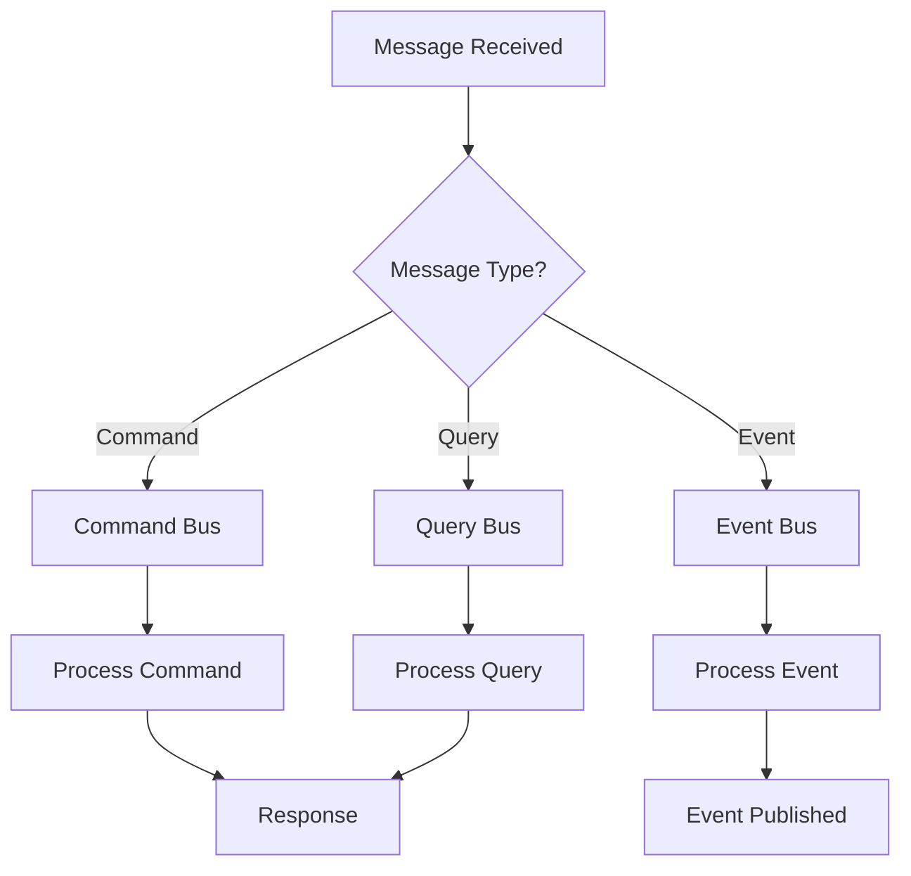
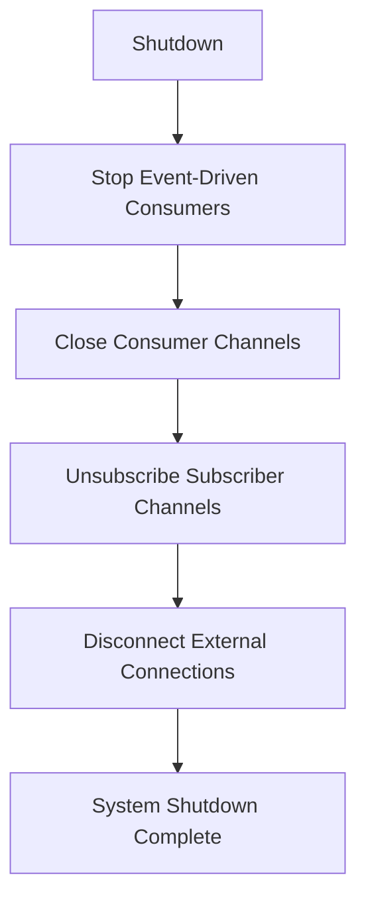

# 📦 MessageSystem - Sistema de Mensagens Hexagonal

## 📋 Índice

1. [Visão Geral](#visão-geral)
2. [Arquitetura do Sistema](#arquitetura-do-sistema)
3. [Componentes Principais](#componentes-principais)
4. [Fluxos de Mensagens](#fluxos-de-mensagens)
5. [Padrões de Consumo](#padrões-de-consumo)
6. [Padrões de Integração](#padrões-de-integração)
7. [Dead Letter Channel](#dead-letter-channel)
8. [Ciclo de Vida do Sistema](#ciclo-de-vida-do-sistema)
9. [Monitoramento e Debug](#monitoramento-e-debug)
10. [Performance e Resiliência](#performance-e-resiliência)
11. [Exemplos de Uso](#exemplos-de-uso)
12. [Documentação Detalhada](#documentação-detalhada)

---

## 🎯 Visão Geral

O MessageSystem implementa uma arquitetura hexagonal baseada em **Enterprise Integration Patterns (EIP)** e **Command Query Responsibility Segregation (CQRS)**, fornecendo uma infraestrutura robusta e flexível para comunicação assíncrona entre componentes de uma aplicação distribuída.

### Características Principais

- ✅ **CQRS**: Separação clara entre comandos e consultas
- ✅ **Event-Driven**: Processamento baseado em eventos e pub/sub
- ✅ **Message Routing**: Roteamento inteligente com suporte a múltiplos canais
- ✅ **Channel Adapters**: Adaptadores para Kafka e outros sistemas externos
- ✅ **Dead Letter Channel**: Tratamento robusto de mensagens falhas
- ✅ **Lifecycle Management**: Gerenciamento completo do ciclo de vida
- ✅ **Error Handling**: Tratamento robusto de erros com retry policies
- ✅ **Context Support**: Suporte a contextos para timeout/cancelação
- ✅ **Performance**: Processamento paralelo e otimização de recursos
- ✅ **Monitoring**: Observabilidade e debug de endpoints ativos

---

## 🏗️ Arquitetura do Sistema

### Estrutura de Pacotes

```
messagesystem/
├── bus/                    # Buses para CQRS
│   ├── command_bus.go     # Bus de comandos
│   ├── query_bus.go       # Bus de consultas
│   └── event_bus.go       # Bus de eventos
├── message/               # Definições de mensagens
│   ├── message.go         # Estruturas de mensagem
│   ├── message_builder.go # Builder para mensagens
│   ├── channel/           # Canais de comunicação
│   ├── endpoint/          # Endpoints de processamento
│   ├── handler/           # Handlers de mensagens
│   └── router/            # Roteadores de mensagens
├── channel/               # Adaptadores de canal
│   └── kafka/            # Integração com Kafka
├── container/             # Container de dependências
└── messagesystem.go      # Sistema principal
```

### Componentes Arquiteturais



---

## 🔧 Componentes Principais

### 1. **Message System Core**

O coração do sistema que gerencia todos os componentes e coordena o fluxo de mensagens.

**Responsabilidades:**

- Gerenciamento de containers de dependências
- Registro e construção de componentes
- Lifecycle management
- Endpoint management

### 2. **Bus Layer (CQRS)**

#### **Command Bus**

```go
// Envio síncrono de comandos
result, err := CommandBus().Send(ctx, createUserCommand)

// Envio assíncrono de comandos
err := CommandBus().SendAsync(ctx, createUserCommand)
```

#### **Query Bus**

```go
// Execução de consultas
user, err := QueryBus().Send(ctx, getUserQuery)

// Consultas assíncronas
err := QueryBus().SendAsync(ctx, getUserQuery)
```

#### **Event Bus**

```go
// Publicação de eventos
err := EventBus().Publish(ctx, userCreatedEvent)
```

### 3. **Message Layer**

#### **Message Structure**

```go
type Message struct {
    Payload    any
    Headers    *messageHeaders
    Context    context.Context
    ReplyRequired bool
}
```

#### **Message Types**

- `Command`: Instruções para executar ações
- `Query`: Solicitações para recuperar dados
- `Event`: Notificações de mudanças de estado

### 4. **Channel Layer**

#### **Point-to-Point Channel**

- Comunicação um-para-um
- Garantia de entrega única
- Processamento sequencial

#### **Pub/Sub Channel**

- Comunicação um-para-muitos
- Distribuição de eventos
- Processamento paralelo

### 5. **Adapter Layer**

#### **Inbound Channel Adapter**

- Recebe mensagens de sistemas externos
- Traduz para formato interno
- Roteia para processamento

#### **Outbound Channel Adapter**

- Envia mensagens para sistemas externos
- Traduz de formato interno
- Gerencia conexões externas

---

## 🔄 Fluxos de Mensagens

### 1. **Fluxo de Comando (Command Flow)**



**Detalhes do Fluxo:**

1. **Application** envia comando através do Command Bus
2. **Command Bus** cria mensagem com tipo `Command` e correlation ID
3. **Message Dispatcher** roteia para o canal apropriado
4. **Gateway** executa interceptors antes e depois do processamento
5. **Action Handler** processa o comando e executa a lógica de negócio
6. **Response** retorna através da mesma cadeia

### 2. **Fluxo de Consulta (Query Flow)**



**Detalhes do Fluxo:**

1. **Application** envia consulta através do Query Bus
2. **Query Bus** cria mensagem com tipo `Query` e correlation ID
3. **Message Dispatcher** roteia para o canal apropriado
4. **Gateway** executa interceptors e roteia para handler
5. **Action Handler** executa consulta e retorna dados
6. **Response** retorna dados através da mesma cadeia

### 3. **Fluxo de Evento (Event Flow)**



**Detalhes do Fluxo:**

1. **Application** publica evento através do Event Bus
2. **Event Bus** cria mensagem com tipo `Event` e correlation ID
3. **Message Dispatcher** publica no canal Pub/Sub
4. **Pub/Sub Channel** distribui para todos os subscribers
5. **Event-Driven Consumer** processa evento assincronamente
6. **Action Handler** executa lógica de negócio baseada no evento

### 4. **Fluxo de Integração Externa (Kafka)**



**Detalhes do Fluxo:**

1. **Application** envia mensagem para adaptador outbound
2. **Message Translator** converte formato interno para Kafka
3. **Kafka Producer** envia mensagem para tópico
4. **Kafka Consumer** recebe mensagem do tópico
5. **Message Translator** converte formato Kafka para interno
6. **Event-Driven Consumer** processa mensagem internamente

### 5. **Fluxo de Event-Driven Consumer**



**Detalhes do Fluxo:**

1. **Inbound Channel Adapter** recebe mensagem de sistema externo
2. **Event-Driven Consumer** adiciona mensagem à fila de processamento
3. **Processors** (múltiplos) consomem mensagens da fila concorrentemente
4. **Gateway** executa interceptors e roteia para handler apropriado
5. **Action Handler** processa a mensagem e executa lógica de negócio
6. **Response** retorna através da cadeia ou mensagem vai para Dead Letter Channel

**Características do Event-Driven Consumer:**

- **Processamento Paralelo**: Múltiplos processors trabalham simultaneamente
- **Queue-based**: Fila interna para gerenciar mensagens
- **Timeout Management**: Controle de timeout por mensagem
- **Error Handling**: Suporte a Dead Letter Channel
- **Graceful Shutdown**: Parada controlada de todos os processors

### 6. **Fluxo de Polling Consumer**



**Detalhes do Fluxo:**

1. **Polling Consumer** inicia ciclo de polling baseado em intervalo configurado
2. **Timer** dispara verificação periódica por mensagens
3. **Inbound Channel Adapter** verifica disponibilidade de mensagens
4. **Gateway** processa mensagem através de interceptors
5. **Action Handler** executa lógica de negócio
6. **Processing Delay** aplica delay configurado entre processamentos
7. **Error Handling** decide se para ou continua baseado na configuração

**Características do Polling Consumer:**

- **Polling Interval**: Intervalo configurável entre verificações
- **Processing Delay**: Delay entre processamento de mensagens
- **Stop on Error**: Configuração para parar em caso de erro
- **Timeout Management**: Controle de timeout por processamento
- **Resource Efficient**: Não consome recursos quando não há mensagens

---

## 🔄 Padrões de Consumo

### 1. **Event-Driven Consumer Pattern**

O Event-Driven Consumer implementa o padrão de consumo baseado em eventos, onde mensagens são processadas assim que chegam, de forma assíncrona e escalável.

#### **Características Principais:**

- **Processamento Assíncrono**: Mensagens são processadas assim que chegam
- **Múltiplos Processors**: Suporte a processamento paralelo com N processors
- **Queue-based**: Fila interna para gerenciar mensagens em trânsito
- **Timeout Management**: Controle de timeout por mensagem processada
- **Error Handling**: Suporte a Dead Letter Channel para mensagens falhadas
- **Graceful Shutdown**: Parada controlada de todos os processors

#### **Configuração Avançada:**

```go
// Configuração de Event-Driven Consumer
consumer := NewEventDrivenConsumerBuilder("user.consumer").
    WithAmountOfProcessors(5).                    // 5 processors paralelos
    WithMessageProcessingTimeout(30 * time.Second). // 30s timeout por mensagem
    Build(container)

// Inicialização
consumer.Run(ctx)

// Shutdown graceful
defer consumer.Stop()
```

#### **Cenários de Uso:**

- **Alta Throughput**: Quando há muitas mensagens chegando simultaneamente
- **Processamento Paralelo**: Quando mensagens podem ser processadas independentemente
- **Real-time Processing**: Quando latência é crítica
- **Scalability**: Quando o sistema precisa escalar horizontalmente

### 2. **Polling Consumer Pattern**

O Polling Consumer implementa o padrão de verificação periódica, onde o sistema verifica periodicamente por novas mensagens para processamento.

#### **Características Principais:**

- **Polling Interval**: Intervalo configurável entre verificações
- **Processing Delay**: Delay entre processamento de mensagens
- **Stop on Error**: Configuração para parar em caso de erro
- **Resource Efficient**: Não consome recursos quando não há mensagens
- **Timeout Management**: Controle de timeout por processamento
- **Error Handling**: Configuração flexível para tratamento de erros

#### **Configuração Avançada:**

```go
// Configuração de Polling Consumer
consumer := NewPollingConsumerBuilder("user.polling").
    WithPollIntervalMilliseconds(1000).           // Verifica a cada 1 segundo
    WithProcessingDelayMilliseconds(100).         // 100ms delay entre processamentos
    WithProcessingTimeoutMilliseconds(30000).     // 30s timeout por processamento
    WithStopOnError(false).                       // Continua mesmo com erros
    Build(container)

// Inicialização
consumer.Run(ctx)

// Shutdown
defer consumer.Stop()
```

#### **Cenários de Uso:**

- **Baixa Frequência**: Quando mensagens chegam esporadicamente
- **Resource Constrained**: Quando recursos são limitados
- **Batch Processing**: Quando processamento em lote é aceitável
- **Legacy Integration**: Quando integração com sistemas legados requer polling

### 3. **Comparação entre Padrões**

| Aspecto            | Event-Driven Consumer            | Polling Consumer                                 |
| ------------------ | -------------------------------- | ------------------------------------------------ |
| **Latência**       | Baixa (processamento imediato)   | Alta (depende do intervalo)                      |
| **Throughput**     | Alto (processamento paralelo)    | Médio (processamento sequencial)                 |
| **Resource Usage** | Alto (processors sempre ativos)  | Baixo (processors ativos apenas durante polling) |
| **Scalability**    | Excelente (múltiplos processors) | Limitada (processamento sequencial)              |
| **Error Handling** | Dead Letter Channel              | Stop on Error ou Continue                        |
| **Complexity**     | Alta (gerenciamento de filas)    | Baixa (lógica simples)                           |
| **Use Case**       | Real-time, alta frequência       | Batch, baixa frequência                          |

### 4. **Seleção do Padrão Adequado**

#### **Use Event-Driven Consumer quando:**

- ✅ Mensagens chegam em alta frequência
- ✅ Latência é crítica
- ✅ Recursos computacionais estão disponíveis
- ✅ Processamento paralelo é necessário
- ✅ Sistema precisa escalar horizontalmente

#### **Use Polling Consumer quando:**

- ✅ Mensagens chegam esporadicamente
- ✅ Recursos são limitados
- ✅ Latência não é crítica
- ✅ Processamento sequencial é aceitável
- ✅ Integração com sistemas legados

---

## 🎨 Padrões de Integração

### 1. **Enterprise Integration Patterns (EIP)**

#### **Channel Adapter Pattern**

- **Inbound**: Recebe mensagens de sistemas externos
- **Outbound**: Envia mensagens para sistemas externos
- **Message Translation**: Conversão entre formatos

#### **Gateway Pattern**

- **Entry Point**: Ponto de entrada para processamento
- **Interceptors**: Execução de lógica antes/depois
- **Routing**: Roteamento para handlers apropriados

#### **Message Router Pattern**

- **Content-Based Routing**: Roteamento baseado no conteúdo
- **Recipient List**: Lista de destinatários dinâmica
- **Message Filter**: Filtragem de mensagens

### 2. **Message Channel Patterns**

#### **Point-to-Point Channel**

```go
// Criação de canal ponto-a-ponto
channel := NewPointToPointChannel("user.commands")

// Envio de mensagem
err := channel.Send(ctx, message)

// Recebimento de mensagem
msg, err := channel.Receive()
```

#### **Publish-Subscribe Channel**

```go
// Criação de canal pub/sub
channel := NewPubSubChannel("user.events")

// Publicação de evento
err := channel.Send(ctx, event)

// Inscrição para receber eventos
channel.Subscribe(handler)
```

### 3. **Consumer Patterns**

#### **Event-Driven Consumer**

```go
// Criação de consumer event-driven
consumer := NewEventDrivenConsumerBuilder("user.consumer").
    WithAmountOfProcessors(5).
    WithMessageProcessingTimeout(30 * time.Second).
    Build(container)

// Inicialização
consumer.Run()
```

#### **Polling Consumer**

```go
// Criação de consumer polling
consumer := NewPollingConsumerBuilder("user.polling").
    WithPollIntervalMilliseconds(1000).
    WithProcessingDelayMilliseconds(100).
    Build(container)

// Inicialização
consumer.Run()
```

---

## 🔄 Ciclo de Vida do Sistema

### 1. **Inicialização (Start)**



**Etapas:**

1. **Register Default Endpoints**: Registra endpoints padrão (command/query)
2. **Build Channel Connections**: Constrói conexões com sistemas externos
3. **Build Outbound Channels**: Constrói canais de saída
4. **Build Inbound Channels**: Constrói canais de entrada

### 2. **Operação (Operation)**



### 3. **Shutdown**



---

## 💡 Exemplos de Uso

### 1. **Configuração do Sistema**

```go
// Configuração de conexão Kafka
kafkaConnection := kafka.NewConnection("kafka.main", []string{"localhost:9092"})
messagesystem.AddChannelConnection(kafkaConnection)

// Configuração de adaptadores
outboundAdapter := kafka.NewPublisherChannelAdapterBuilder("kafka.main", "user.events")
messagesystem.AddPublisherChannel(outboundAdapter)

inboundAdapter := kafka.NewConsumerChannelAdapterBuilder("kafka.main", "user.events", "user.consumer")
messagesystem.AddConsumerChannel(inboundAdapter)

// Registro de handlers
messagesystem.AddActionHandler(createUserHandler)
messagesystem.AddActionHandler(getUserHandler)

// Inicialização
messagesystem.Start()
```

### 2. **Uso de Command Bus**

```go
// Criação de comando
createUserCommand := &CreateUserCommand{
    Name:  "John Doe",
    Email: "john@example.com",
}

// Envio síncrono
user, err := messagesystem.CommandBus().Send(ctx, createUserCommand)
if err != nil {
    log.Error("Failed to create user", "error", err)
    return
}

// Envio assíncrono
err = messagesystem.CommandBus().SendAsync(ctx, createUserCommand)
if err != nil {
    log.Error("Failed to send command", "error", err)
    return
}
```

### 3. **Uso de Query Bus**

```go
// Criação de consulta
getUserQuery := &GetUserQuery{
    UserID: "123",
}

// Execução de consulta
user, err := messagesystem.QueryBus().Send(ctx, getUserQuery)
if err != nil {
    log.Error("Failed to get user", "error", err)
    return
}
```

### 4. **Uso de Event Bus**

```go
// Criação de evento
userCreatedEvent := &UserCreatedEvent{
    UserID: "123",
    Name:   "John Doe",
    Email:  "john@example.com",
}

// Publicação de evento
err := messagesystem.EventBus().Publish(ctx, userCreatedEvent)
if err != nil {
    log.Error("Failed to publish event", "error", err)
    return
}
```

### 5. **Event-Driven Consumer**

```go
// Criação de consumer com configuração avançada
consumer, err := messagesystem.EventDrivenConsumer("user.consumer")
if err != nil {
    log.Error("Failed to create consumer", "error", err)
    return
}

// Configuração de processors e timeouts
consumer.WithAmountOfProcessors(5).
    WithMessageProcessingTimeout(30 * time.Second)

// Inicialização
consumer.Run(ctx)

// Shutdown graceful
defer consumer.Stop()
```

### 6. **Polling Consumer**

```go
// Criação de polling consumer
pollingConsumer := NewPollingConsumerBuilder("user.polling").
    WithPollIntervalMilliseconds(1000).           // Verifica a cada 1 segundo
    WithProcessingDelayMilliseconds(100).         // 100ms delay entre processamentos
    WithProcessingTimeoutMilliseconds(30000).     // 30s timeout por processamento
    WithStopOnError(false).                       // Continua mesmo com erros
    Build(container)

// Inicialização
pollingConsumer.Run(ctx)

// Shutdown
defer pollingConsumer.Stop()
```

### 7. **Configuração de Dead Letter Channel**

```go
// Configuração de Dead Letter Channel para mensagens falhadas
deadLetterChannel := NewPointToPointChannel("dead.letter.channel")

// Configuração de consumer com Dead Letter Channel
consumer := NewEventDrivenConsumerBuilder("user.consumer").
    WithDeadLetterChannel(deadLetterChannel).
    WithAmountOfProcessors(3).
    Build(container)

// Processamento de mensagens falhadas
go func() {
    for {
        msg, err := deadLetterChannel.Receive()
        if err != nil {
            log.Error("Failed to receive from dead letter channel", "error", err)
            continue
        }

        // Processamento especial para mensagens falhadas
        log.Warn("Processing failed message", "messageId", msg.GetHeaders().CorrelationId)
        // Lógica de retry ou notificação
    }
}()
```

---

## 🔍 Monitoramento e Debug

### 1. **Show Active Endpoints**

```go
// Exibe todos os endpoints ativos
messagesystem.ShowActiveEndpoints()

// Output:
// ---[Message System] Active Endpoints ---
// Endpoint Name                    | Type
// -------------------------------------------
// default.channel.command          | [outbound] Command-Bus
// default.channel.query            | [outbound] Query-Bus
// user.consumer                    | [inbound] Event-Driven
// user.polling                     | [inbound] Polling
// dead.letter.channel              | [inbound] Point-to-Point
// -------------------------------------------
```

### 3. **Logging e Observabilidade**

O sistema utiliza `slog` para logging estruturado:

```go
// Logs de inicialização
slog.Info("[message-system] starting...")

// Logs de processamento
slog.Info("[message-system] message processed",
    "messageId", messageID,
    "type", messageType,
    "duration", processingTime)

// Logs de Event-Driven Consumer
slog.Info("[event-driven-consumer] message received",
    "consumerName", consumerName,
    "processorId", processorId,
    "queueSize", queueSize)

// Logs de Polling Consumer
slog.Info("[polling-consumer] polling cycle",
    "consumerName", consumerName,
    "messagesFound", messageCount,
    "processingTime", processingTime)

// Logs de Dead Letter Channel
slog.Warn("[dead-letter-channel] message failed",
    "messageId", messageId,
    "error", errorMessage,
    "retryCount", retryCount)

// Logs de shutdown
slog.Info("[message-system] shutting down...")
```

---

## 🚀 Considerações de Performance

### 1. **Concorrência**

- **Goroutines**: Processamento assíncrono com goroutines
- **Channels**: Comunicação thread-safe entre componentes
- **Context**: Controle de timeout e cancelamento

### 2. **Escalabilidade**

- **Event-Driven**: Processamento paralelo de eventos
- **Connection Pooling**: Reutilização de conexões
- **Message Batching**: Agrupamento de mensagens quando possível

### 3. **Resiliência**

- **Error Handling**: Tratamento robusto de erros
- **Retry Logic**: Lógica de retry para operações falhadas
- **Circuit Breaker**: Proteção contra falhas em cascata

---

## 📚 Conclusão

O MessageSystem fornece uma infraestrutura robusta e escalável para comunicação entre componentes de uma aplicação distribuída. Com suporte completo a padrões CQRS, event-driven architecture e Enterprise Integration Patterns, o sistema oferece:

- **Flexibilidade**: Suporte a múltiplos padrões de comunicação e extensibilidade
- **Escalabilidade**: Processamento paralelo, Event-Driven e Polling Consumers
- **Confiabilidade**: Dead Letter Channel, retry policies e circuit breakers
- **Observabilidade**: Logging estruturado e monitoramento de endpoints
- **Performance**: Otimização de recursos e processamento paralelo eficiente
- **Manutenibilidade**: Código bem documentado e arquitetura hexagonal limpa

A arquitetura hexagonal modular permite fácil extensão e adaptação para diferentes cenários de uso, desde aplicações simples até sistemas distribuídos complexos.

## 📖 Documentação Detalhada

Para uma documentação completa do MessageSystem, incluindo exemplos detalhados, diagramas e considerações de arquitetura, consulte o [README do pacote messagesystem](pkg/core/infrastructure/messagesystem/README.md).

---

> 💡 **Nota:** Este projeto é um exemplo prático de implementação de padrões EIP e CQRS em Go usando arquitetura hexagonal.

Última atualização: 27 de setembro de 2025
