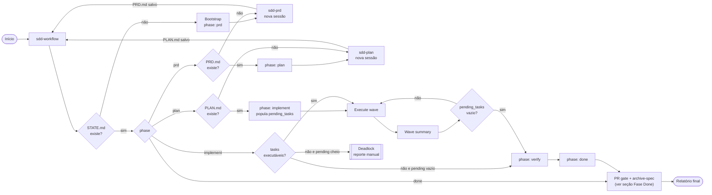
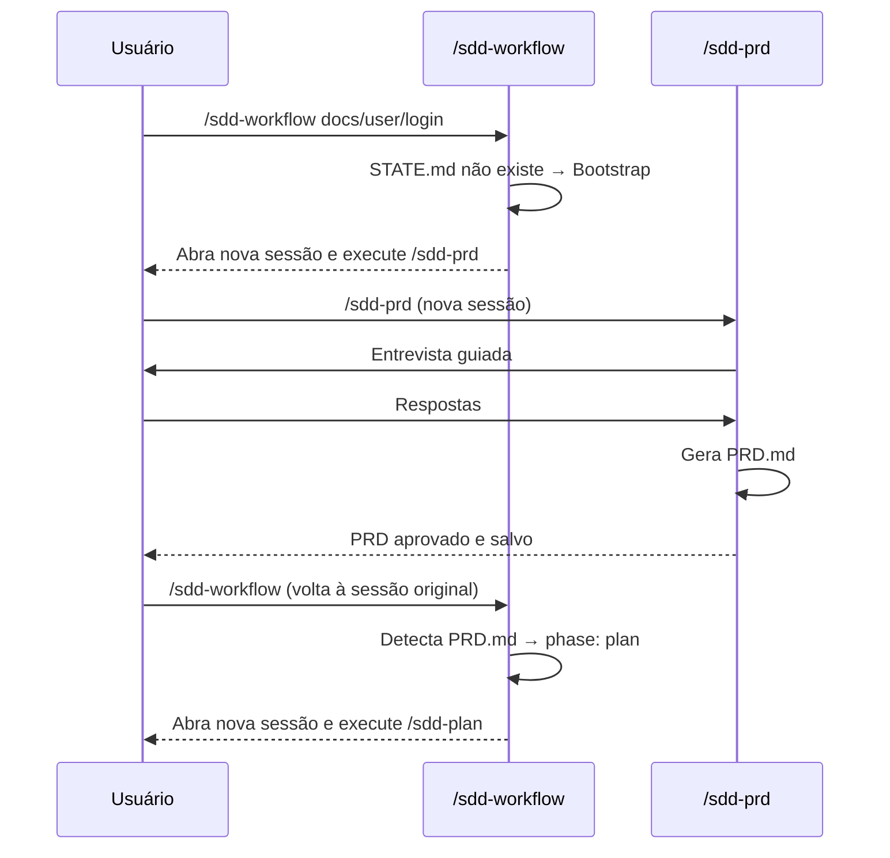
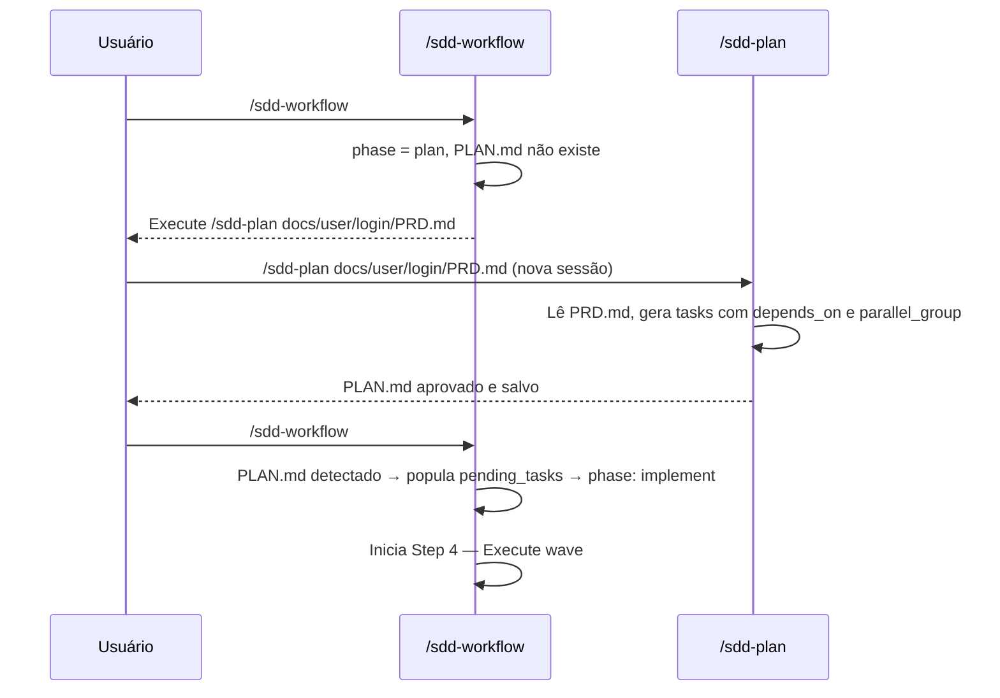
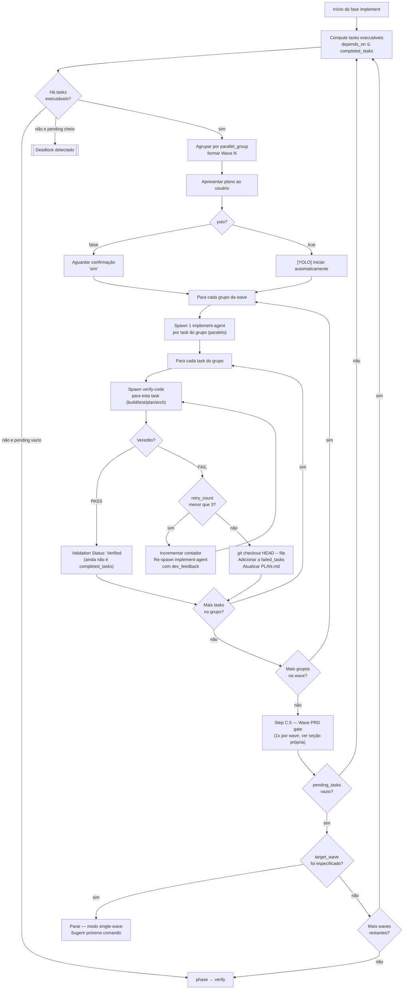
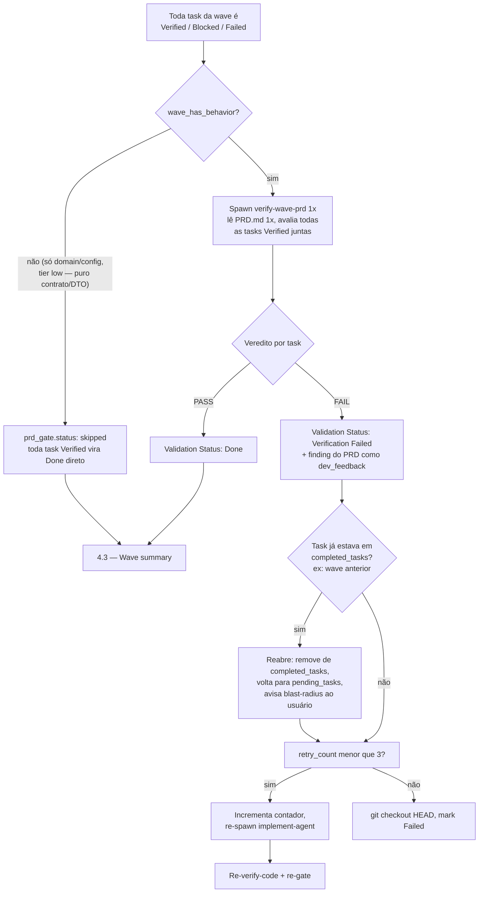
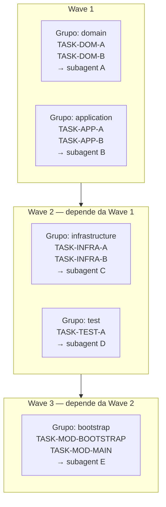
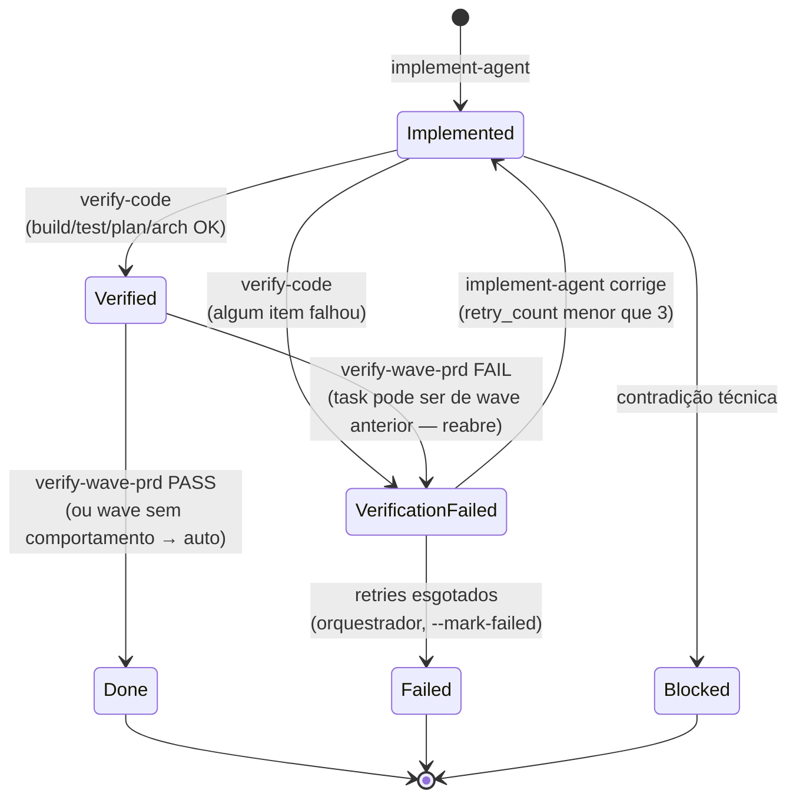
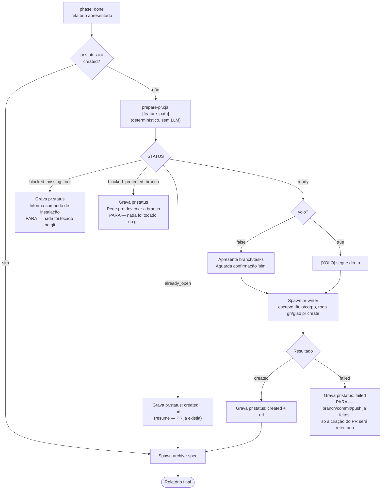
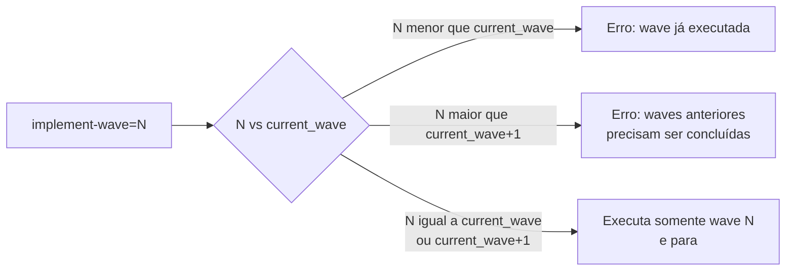
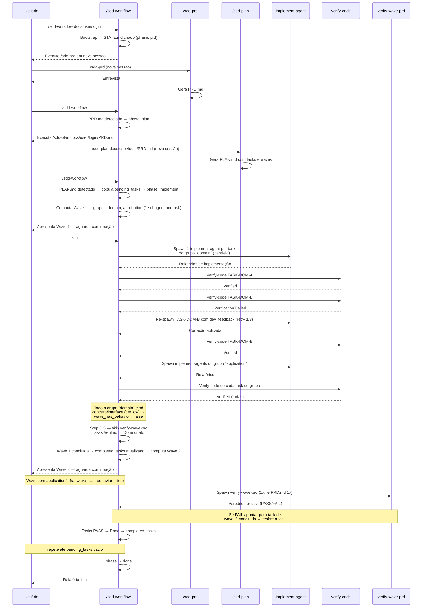

# SDD — Spec-Driven Development Guideline

Spec-Driven Development (SDD) é um pipeline de desenvolvimento orientado por especificação. Cada
feature passa por fases ordenadas — PRD → Plan → Implement → Verify → Done — onde a saída de
cada fase é um artefato em disco que serve de entrada para a próxima. O orquestrador (`/sdd-workflow`)
é stateless: relê o `STATE.md` a cada invocação e executa exatamente uma ação.

---

## Visão geral do pipeline



---

## Componentes

### Skills (sessões interativas — humano no loop)

| Skill | Responsabilidade | Quando usar |
|-------|-----------------|-------------|
| `/sdd-workflow` | Orquestrador do pipeline; lê `STATE.md` e direciona a próxima ação | Sempre que avançar ou retomar o pipeline |
| `/sdd-prd` | Conduz entrevista com o usuário e gera `PRD.md` | Fase `prd` |
| `/sdd-plan` | Lê `PRD.md` e gera `PLAN.md` com tasks, waves e dependências | Fase `plan` |

### Subagents (autônomos — spawned pelo orquestrador)

Cada subagent é spawnado **por task** (não por grupo/wave) — um grupo com M tasks gera M
implement-agents e M verify-code agents em paralelo, um por task.

| Subagent | Arquivo | Responsabilidade | Granularidade |
|----------|---------|-----------------|---------------|
| implement-agent | `.agentic/subagents/implement-agent.md` | Implementa uma task | 1x por task |
| verify-code | `.agentic/subagents/verify-code.md` | Verifica uma task contra build, testes, PLAN.md e arquitetura (não PRD) | 1x por task |
| verify-wave-prd | `.agentic/subagents/verify-wave-prd.md` | Verifica conformidade com o PRD.md do conjunto de tasks já `Verified` da wave | 1x por wave |
| pr-writer | `.agentic/subagents/pr-writer.md` | Escreve título/descrição do PR/MR e o abre via `gh`/`glab` — branch/commit/push já foram feitos deterministicamente por `prepare-pr.cjs` antes deste spawn | 1x por feature (fase `done`) |
| archive-spec | `.agentic/subagents/archive-spec.md` | Move `PRD.md`/`PLAN.md`/`NOTES.md` para um destino externo (ex: Obsidian) e remove os locais | 1x por feature (fase `done`, após o PR gate) |

`verify-code` é o antigo `verify-agent`, renomeado — a checagem de PRD saiu do checklist por task
e virou um gate único por wave (`verify-wave-prd`), rodado depois que toda a wave termina o
verify-code. Motivo: requisitos de PRD (`RF-XX`/`RN-XX`) são escritos no nível de fluxo/feature,
não de arquivo — uma task isolada (ex: uma interface de domínio pura) muitas vezes não tem como
satisfazer ou violar um requisito sozinha, então checar isso por task gerava leituras redundantes
do PRD e vereditos de baixo sinal.

### Artefatos em disco

```
docs/{module}/{feature}/
├── PRD.md        ← requisitos de produto (gerado por /sdd-prd)
├── PLAN.md       ← plano técnico com tasks, waves e grupos (gerado por /sdd-plan)
├── NOTES.md      ← notas opcionais detectadas automaticamente
└── STATE.md      ← fonte única de verdade do orquestrador

sdd-workflow.config.json   ← config do pipeline (raiz do repo), ver "Configuração" abaixo
```

---

### Configuração (`sdd-workflow.config.json`)

Arquivo opcional na **raiz do repo**, versionado — customiza o comportamento de git/PR do pipeline
sem exigir que um LLM interprete prosa a cada execução. Se ausente, `prepare-pr.cjs` usa os defaults
abaixo (um clone novo do chassi funciona sem setup):

```json
{
  "git": {
    "provider": "auto",
    "base_branch": "main",
    "auto_create_branch": true,
    "branch_pattern": "{type}/{feature-slug}",
    "default_type": "feat"
  },
  "archive_spec": {
    "destination_type": "mcp",
    "destination_name": "obsidian"
  }
}
```

| Campo | Default | Descrição |
|-------|---------|-----------|
| `provider` | `auto` | `github` \| `gitlab` \| `none`. Em `auto`, detecta pelo `git remote get-url origin` (`github.com` → `gh`, `gitlab` → `glab`). `none` desliga a criação de PR/MR — o pipeline só garante commit/push. |
| `base_branch` | `main` | Branch alvo do PR/MR e referência para decidir se é preciso criar uma branch nova. |
| `auto_create_branch` | `true` | Se `false`, o pipeline nunca cria branch — bloqueia e pede para o dev criar manualmente. |
| `branch_pattern` | `{type}/{feature-slug}` | Usado só quando uma branch nova precisa ser criada; `{feature-slug}` é o último segmento do `feature_path` (ex: `docs/user/login` → `login`); `{type}` vem do header `**Type:**` do `PLAN.md`. |
| `default_type` | `feat` | Tipo Conventional Commits usado quando o `PLAN.md` não tem (ou tem inválido) o header `**Type:**` — cobre specs criadas antes desse campo existir. |

`archive_spec` customiza para onde o agente `archive-spec` envia `PRD.md`/`PLAN.md`/`NOTES.md` ao
concluir a fase `done`. Se a seção (ou o arquivo inteiro) estiver ausente, o orquestrador usa os
defaults acima (Obsidian via MCP), preservando o comportamento original.

| Campo | Default | Descrição |
|-------|---------|-----------|
| `destination_type` | `mcp` | `mcp` \| `skill` \| `none`. `mcp` procura uma tool `mcp__{destination_name}__*` na sessão; `skill` invoca a skill chamada `{destination_name}` (útil quando o envio segue regras próprias ou uma mecânica customizada que não faz sentido chamar o MCP diretamente); `none` desativa o arquivamento — o agente reporta `no-destination-available` sem tentar nada. |
| `destination_name` | `obsidian` | Nome do MCP (sem o prefixo `mcp__`) ou da skill, dependendo de `destination_type`. |

Se `destination_type`/`destination_name` apontar para um MCP ou skill que não está disponível na
sessão, o agente `archive-spec` não tenta adivinhar outro mecanismo: reporta
`STATUS: no-destination-available`, avisa o usuário e **não apaga nenhum arquivo local** — a
mecânica original (manter os artefatos em `docs/`) é preservada.

### Type — Conventional Commits

A classificação (`feat | fix | refactor | perf | chore | docs | test | build | ci`) é decidida
**uma vez, na fase PRD** — `/sdd-prd` pergunta o `Tipo` junto da pergunta de módulo/nome da feature
(Step 3), sugerindo um valor a partir do conteúdo da entrevista (defeito descrito → `fix`, capacidade
nova → `feat`, etc.), e grava no header `**Tipo:**` do `PRD.md`. Não é perguntado de novo na fase de
plano: o `scaffold.cjs` de `/sdd-plan` lê o `Tipo` do `PRD.md` da mesma feature e propaga
automaticamente para o header `**Type:**` do `PLAN.md` (fallback `feat` se o PRD não tiver o campo —
specs antigas, criadas antes desse campo existir). `prepare-pr.cjs` lê `**Type:**` do `PLAN.md` e o
usa tanto no nome da branch (via `{type}` no `branch_pattern`) quanto no título do commit/PR
(`{type}({module}): implement {feature-slug}`) — assim uma spec de bugfix gera `fix/...` e uma de
refactor gera `refactor/...`, em vez de tudo sair como `feat` independente da natureza da mudança.

**Regra de criação de branch:** a branch atual é comparada com a `HEAD` remota (`origin/HEAD`, local
via `git symbolic-ref`, sem chamada de rede) **e** com `base_branch`. Se a branch atual for igual a
qualquer uma das duas, o dev ainda não saiu da base → cria uma branch nova via `branch_pattern`
(ou bloqueia, se `auto_create_branch: false`). Se for diferente de ambas, assume que o dev já criou
a branch de feature manualmente e reutiliza a atual sem criar nada.

---

## STATE.md — Fonte única de verdade

O `STATE.md` persiste o progresso entre sessões. O orquestrador **nunca** depende de memória de
conversa — sempre relê este arquivo.

```yaml
# SDD State
feature: {module}/{feature-name}
phase: prd                        # prd | plan | implement | verify | done

artifacts:
  prd:   ""                       # preenchido quando PRD.md é detectado
  notes: ""                       # preenchido quando NOTES.md é detectado
  plan:  ""                       # preenchido quando PLAN.md é detectado

implement:
  current_wave: 1
  completed_tasks: []             # IDs confirmados após cada wave
  pending_tasks:   []             # IDs extraídos do PLAN.md na transição plan → implement
  current_wave_groups: []         # grupos em execução na wave atual (para retomada)

verify:
  retry_counts: {}                # map task_id → número de tentativas (máx 3)
  failed_tasks: []                # objetos {id, reason} — tasks que esgotaram retentativas
  prd_gate:                       # status do gate verify-wave-prd (1x por wave)
    wave: null                    # a qual wave este status se refere
    status: pending                # pending | passed | failed | skipped

pr:
  status: not_started             # not_started | blocked_missing_tool |
                                   # blocked_protected_branch | created | failed
  url: ""                         # preenchido quando o PR/MR é criado
  branch: ""                      # branch decidida/criada por prepare-pr.cjs
```

**Regras de escrita:**
- Nunca sobrescrever o `STATE.md` inteiro — atualizar apenas os campos modificados.
- `completed_tasks` só é atualizado após a task passar por **dois** vereditos: PASS do
  `verify-code` (vira `Verified`) **e** PASS do `verify-wave-prd` da wave (vira `Done`) — ou o
  gate ser `skipped` porque a wave não tem comportamento checável (só contratos/DTOs). Ver
  `prd_gate` acima.
- Uma task já em `completed_tasks` pode ser **reaberta** (volta para `pending_tasks`) se o gate de
  PRD de uma wave posterior encontrar um defeito nela — é o único caso em que uma task sai de
  `completed_tasks` depois de entrar.
- `failed_tasks` é permanente — tasks nesta lista nunca são re-executadas.
- `pr` só avança para `created` quando o PR/MR realmente existe. `blocked_missing_tool` e
  `blocked_protected_branch` são paradas retomáveis, não falhas — o próximo `/sdd-workflow` re-entra
  automaticamente na fase `done` e tenta de novo. `archive-spec` só é spawnado depois de `pr.status`
  chegar em `created`.

---

## Fases em detalhe

### Fase PRD



**Transição:** `PRD.md` detectado em disco → `phase: plan`.

---

### Fase Plan



**Transição:** `PLAN.md` detectado em disco → extrai todos os IDs de tasks para `pending_tasks` → `phase: implement`.

---

### Fase Implement — Waves

O implement executa tasks em **waves**. Cada wave agrupa tasks cujas dependências já foram concluídas.
Dentro de uma wave, tasks com arquivos independentes são agrupadas em **parallel_groups** e
executadas por subagents separados.



#### Step C.5 — Wave PRD gate (1x por wave)

Depois que **todos** os grupos da wave terminam o verify-code (todas as tasks `Verified`,
`Blocked` ou `Failed`), roda uma vez só, não por grupo:



#### Lógica de waves e grupos



---

### Lógica de retry e revert — ciclo de vida do `Validation Status`



`Verified` é um estado intermediário: tecnicamente correto, mas ainda não passou pelo gate de PRD
da wave. Só `Done` entra em `completed_tasks`.

---

### Fase Verify (gate)

A verificação real acontece por task dentro do Step 4.2. A fase `verify` é apenas um gate de
completude:

- `pending_tasks` vazio → `phase: done`
- `pending_tasks` com dependências não satisfeitas → deadlock, resolução manual

---

### Fase Done

Relatório final consolidado com tasks concluídas e tasks que falharam após 3 tentativas.
Tasks com falha tiveram seus arquivos revertidos para `HEAD` e estão marcadas no `PLAN.md`
como `Validation Status: Failed`.

Depois de apresentar esse relatório, e **antes** do arquivamento da spec, o orquestrador roda o
**PR gate**: garante que o código implementado vira um commit, é enviado ao remoto e tem um PR/MR
aberto — só então a spec (`PRD.md`/`PLAN.md`/`NOTES.md`) é arquivada e removida de `docs/`.



**Pontos importantes:**
- `prepare-pr.cjs` nunca toca o git se a CLI (`gh`/`glab`) exigida pelo `provider` não estiver
  instalada — o bloqueio acontece antes de qualquer `git add`/`checkout`/`push`, para que um re-run
  comece de um estado limpo.
- Um único commit é feito no fim da fase `done`, nunca por wave — isso é o que preserva
  `git checkout HEAD -- {file}` funcionando durante os retries de todas as waves anteriores (ver
  "Lógica de retry e revert" acima); commitar por wave quebraria essa premissa.
- Os arquivos do commit vêm só dos campos `File:` das tasks marcadas `[x]`/`[y]` no `PLAN.md` — nunca
  `git add -A`, para não arrastar mudanças não relacionadas à feature que estejam soltas no working
  tree.
- `--yolo` também controla a confirmação antes do push/PR (assim como já controla a confirmação de
  wave) — push é uma ação visível a terceiros e mais difícil de reverter que uma wave local, então em
  modo não-YOLO ela é sempre confirmada explicitamente.
- `pr.status: failed`/`blocked_*` nunca bloqueiam o relatório já apresentado ao usuário — apenas
  adiam o `archive-spec`, que só roda depois que `pr.status` chega em `created`.

---

## Referência de comandos

### `/sdd-workflow [path] [implement-wave=N] [--yolo]`

Orquestrador principal. Pode ser chamado a qualquer momento para avançar ou retomar o pipeline.

| Argumento | Tipo | Padrão | Descrição |
|-----------|------|--------|-----------|
| `path` | string | auto-detect | Caminho da feature (ex: `docs/user/login`). Se omitido, faz glob de `docs/**/STATE.md`. |
| `implement-wave=N` | inteiro | `null` (todas) | Executa somente a wave N. Após concluir, para e sugere o próximo comando. |
| `--yolo` | flag | `false` | Pula a confirmação manual antes de spawnar subagents. Retry, revert e deadlock detection permanecem ativos. |

**Exemplos:**

```bash
# Iniciar ou retomar o pipeline (detecta feature automaticamente)
/sdd-workflow

# Especificar a feature explicitamente
/sdd-workflow docs/user/login

# Executar apenas a wave 2
/sdd-workflow docs/user/login implement-wave=2

# Executar todas as waves sem confirmações
/sdd-workflow --yolo

# Executar apenas a wave 2 sem confirmação
/sdd-workflow docs/user/login implement-wave=2 --yolo
```

**Validações do `implement-wave=N`:**



---

### `/sdd-prd`

Conduz uma entrevista guiada com o usuário para entender o problema e gera `PRD.md` com
requisitos claros e orientados a produto. Deve ser executado em uma **nova sessão**.

```bash
/sdd-prd
```

---

### `/sdd-plan [prd_path]`

Lê o `PRD.md` e gera `PLAN.md` com tasks organizadas em waves, dependências, `parallel_group`
e `tier` de risco. Deve ser executado em uma **nova sessão**.

```bash
/sdd-plan docs/user/login/PRD.md
```

---

## Estrutura do PLAN.md

O `PLAN.md` gerado pelo `/sdd-plan` organiza as tasks da seguinte forma:

```
TASK-{CAMADA}-{FEATURE}-{COMPONENTE}
  File:         internal/{module}/{camada}/{arquivo}.go
  depends_on:   [TASK-ID-A, TASK-ID-B]
  parallel_group: domain | application | infrastructure | test | bootstrap
  tier:         low | medium | high
  risk_note:    (presente apenas para tier high)
  Sub-tasks:
    - descrição do que implementar
  Completion criterion:
    - critério verificável de conclusão
```

**Convenção de IDs por camada:**

| Prefixo | Camada |
|---------|--------|
| `TASK-DOM-*` | Domain (contratos, interfaces) |
| `TASK-APP-*-COMMAND` | Application (commands/DTOs) |
| `TASK-APP-*-HANDLER` | Application (handlers) |
| `TASK-INFRA-*-HTTP` | Infrastructure (HTTP handlers) |
| `TASK-INFRA-*-REPO` | Infrastructure (repositórios) |
| `TASK-INFRA-*-SERVICE` | Infrastructure (serviços externos) |
| `TASK-TEST-*` | Testes |
| `TASK-MOD-*` | Bootstrap do módulo |

---

## Subagent: implement-agent

Executa **uma task** (não um grupo inteiro — cada task do grupo gera seu próprio implement-agent,
rodando em paralelo com as demais). Opera sobre o código do projeto seguindo o `PLAN.md` como
especificação imutável.

**Protocolo por task:**
1. Extrai só o bloco da própria task no `PLAN.md` via `grep` pontual — nunca lê o arquivo inteiro
   (que contém todas as tasks de todas as waves).
2. Carrega a referência relevante da skill `ddd-module-knowledge`
3. Implementa os sub-tasks exatamente como especificado
4. Aplica `/adjust-go-code` para formatar e documentar
5. Verifica conformidade com o `PRD.md` — lê só a seção de Scope/Acceptance Criteria quando
   possível, não o arquivo inteiro. Este é um autocheck do próprio implementador; o gate
   autoritativo de PRD é o `verify-wave-prd`, 1x por wave (ver abaixo).
6. Gera testes unitários com `/make-unit-tests`, a menos que `{has_dedicated_test_task}` seja
   `true` (calculado 1x pelo orquestrador com um grep nos blocos `TASK-TEST-*`, não pelo agente)
7. Executa `go build ./...` — bloqueia se houver erro de compilação
8. Preenche o bloco de execução da task no `PLAN.md` (`Validation Status: Implemented`)

**Restrições:** nunca modifica arquivos fora da própria task; nunca atualiza `STATE.md`; nunca
marca o checkbox `[ ]`/`[x]` do `PLAN.md` (isso é exclusivo do orquestrador via `update-plan.cjs`);
nunca improvisa além do especificado no `PLAN.md`.

---

## Subagent: verify-code

Verifica **uma task** (1x por task, em paralelo com as demais do grupo) contra um checklist de 4
itens técnicos. Não checa PRD e não modifica código — apenas reporta falhas para que o
orquestrador dispare um ciclo de correção.

**Checklist por task:**

| # | Verificação | Critério |
|---|-------------|----------|
| 1 | Build limpo | `go build ./...` sem erros ou warnings |
| 2 | Suite de testes | `go test ./...` — todos os testes passam |
| 3 | Conformidade com PLAN.md | Checklist de execução preenchido, arquivo correto, sub-tasks implementados (via `validate-execution.cjs` + bloco extraído por grep) |
| 4 | Conformidade arquitetural | Interfaces no pacote correto, sem imports inválidos entre camadas, ISP respeitado |

**Veredito:**
- **PASS** → todos os 4 itens passam → `Validation Status: Verified` (**não** `Done` — falta o gate de PRD da wave)
- **FAIL** → qualquer item falha → `Validation Status: Verification Failed`; lista cada falha com `file:line` e descrição precisa

---

## Subagent: verify-wave-prd

Roda **1x por wave**, depois que todas as tasks de **todos os grupos** da wave chegam a `Verified`
— não 1x por grupo, nem 1x por task.
É pulado inteiramente quando a wave inteira é composta só de contratos/DTOs sem comportamento
executável (`wave_has_behavior: false`).

**Por que existe separado do verify-code:** requisitos de PRD (`RF-XX`/`RN-XX`) são escritos no
nível de fluxo/feature, não de arquivo — uma task isolada de domínio (ex: uma interface pura) não
tem como satisfazer ou violar sozinha um requisito de comportamento. Checar isso por task, uma vez
por task, gastava tokens repetindo a leitura do `PRD.md` e produzia um veredito de baixo sinal em
waves só de contrato.

**Funcionamento:**
- Lê o `PRD.md` **uma única vez** (não uma vez por task).
- Avalia, em conjunto, todas as tasks `Verified` da wave contra os requisitos do PRD.
- Retorna um veredito **por task** (não um veredito único da wave), para manter a rastreabilidade
  do ciclo de retry existente.
- **PASS** → `Validation Status: Done` (estado terminal; a task entra em `completed_tasks`)
- **FAIL** → `Validation Status: Verification Failed` com o finding do PRD como `dev_feedback`. Se
  a task implicada já pertence a uma wave anterior já concluída (o defeito só ficou visível agora
  que uma wave posterior ligou as peças), o orquestrador **reabre** essa task — volta de
  `completed_tasks` para `pending_tasks` — e avisa quais tasks concluídas dependem do arquivo
  reaberto (aviso, não re-verificação automática dessas dependentes).

---

## Fluxo completo — exemplo prático



---

## Modos de operação

### Modo padrão (todas as waves, com confirmação)

```bash
/sdd-workflow
```

O pipeline executa wave por wave, aguardando confirmação do usuário antes de cada uma.

### Modo single-wave

```bash
/sdd-workflow implement-wave=2
```

Executa somente a wave 2. Após concluir, para e informa:
```
Wave 2 concluída (modo single-wave).

Para continuar, execute /sdd-workflow novamente.
Para executar apenas a próxima wave: /sdd-workflow implement-wave=3
```

### Modo YOLO (sem confirmações)

```bash
/sdd-workflow --yolo
```

Executa todas as waves sem aguardar confirmação manual. Retry, revert e deadlock detection
**permanecem ativos** — apenas o prompt de confirmação é suprimido.

### Modo YOLO + single-wave

```bash
/sdd-workflow implement-wave=2 --yolo
```

Executa apenas a wave 2 sem nenhuma confirmação.

---

## Recuperação de falhas

### Sessão interrompida no meio de uma wave

O `STATE.md.implement.current_wave_groups` registra quais grupos estavam em execução.
Ao invocar `/sdd-workflow` novamente, o orquestrador detecta o estado parcial, re-apresenta
a wave atual e pergunta se deseja re-executar ou pular.

### Deadlock de dependências

Ocorre quando `pending_tasks` não está vazio mas nenhuma task tem `depends_on` satisfeito.
Solução: revisar o `PLAN.md` manualmente e corrigir as dependências.

### Task em `failed_tasks`

Após 3 tentativas fracassadas, a task é revertida (`git checkout HEAD -- {file}`) e marcada
no `PLAN.md` como `Validation Status: Failed`. O pipeline continua para as demais tasks —
`failed_tasks` nunca bloqueia o avanço de fase.

Para re-tentar uma task falha: corrigir o `PLAN.md` manualmente (remover da `failed_tasks`
e adicionar de volta em `pending_tasks`) e invocar `/sdd-workflow` novamente.

### Task reaberta pelo gate de PRD (`verify-wave-prd`)

Se o gate de PRD de uma wave encontra um defeito rastreado a uma task de uma **wave anterior já
concluída** (ex: um contrato de domínio cujo campo só se mostra incorreto quando ligado a um
handler waves depois), o orquestrador:
1. Remove a task de `completed_tasks` e devolve para `pending_tasks` (`--remove-completed` /
   `--add-pending` em `write-state.cjs`).
2. Avisa quais tasks concluídas de waves posteriores dependem do arquivo reaberto — isso é apenas
   um **aviso de blast-radius**, não uma re-verificação automática dessas dependentes: uma cascata
   automática de re-verificação transformaria um único achado de PRD em uma re-execução completa
   do pipeline, o que exige aprovação explícita do dev, não um comportamento silencioso por padrão.
3. Aplica o mesmo ciclo de retry (`retry_counts`, máx. 3 tentativas) usado para qualquer outra
   falha de verify-code.

### PR/MR bloqueado por ferramenta ausente (`pr.status: blocked_missing_tool`)

`prepare-pr.cjs` detectou que o provider (`github`/`gitlab`, auto-detectado ou fixado em
`sdd-workflow.config.json`) exige uma CLI (`gh`/`glab`) que não está instalada. Nada no git foi
tocado. Solução: instalar e autenticar a CLI (`brew install gh && gh auth login`, ou equivalente
para `glab`) e invocar `/sdd-workflow {feature_path}` novamente — a fase `done` é re-detectada e o
PR gate é retentado automaticamente a partir do zero.

### PR/MR bloqueado por branch protegida (`pr.status: blocked_protected_branch`)

A branch atual é a `base_branch` (ou a `HEAD` remota) e `auto_create_branch` está `false` em
`sdd-workflow.config.json`. Solução: criar e dar checkout numa branch de feature manualmente, depois
invocar `/sdd-workflow {feature_path}` novamente.

### Falha ao criar o PR/MR (`pr.status: failed`)

Branch, commit e push já foram concluídos por `prepare-pr.cjs` — nada foi perdido. Apenas a chamada
`gh pr create`/`glab mr create` (feita pelo subagent `pr-writer`) falhou. Solução: verificar a causa
(auth expirada, permissão, etc.) e invocar `/sdd-workflow {feature_path}` novamente — o gate detecta
que não há PR/MR aberto para a branch e tenta criar de novo, sem re-commitar nada.
