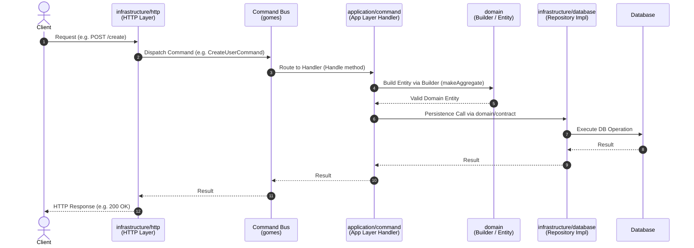

# Architecture Overview
This document serves as a critical, living template designed to equip agents with a rapid and comprehensive understanding of the codebase's architecture, enabling efficient navigation and effective contribution from day one. Update this document as the codebase evolves.


### Project Structure
This section provides a high-level overview of the project's directory and file structure, categorised by architectural layer or major functional area. It is essential for quickly navigating the codebase, locating relevant files, and understanding the overall organization and separation of concerns.

```
[project-name]/
├── cmd/								#entry points of the application
│   └── api/
│       └── main.go
├── internal/  							# private code of the application
│   ├── [module-name]/ 					# module of the application
│   │   ├── domain/ 					# domain of the application
│   │   │   ├── contract/ 				# contracts of the domain
│   │   │   ├── event/ 					# events of the domain
│   │   │   ├── entity.go 				# entities of the domain
│   │   │   └── builder.go 				# builders of the domain
│   │   ├── application/ 				# application of the application
│   │   │   ├── command/ 				# commands of the application
│   │   │   └── query/ 					# queries of the application
│   │   └── infrastructure/ 			# infrastructure of the application
│   │       ├── database/ 				# database of the application
│   │       └── http/ 					# http of the application
│   └── [module-name]/[module-name].go 	# module file of the application
├── pkg/ 								# public code of the application
├── vendor/ 							# vendored dependencies
```

### High-Level System Diagram



### Modules Rules

- modules must be created in `internal` folder
- modules must be independent of each other
- modules must have the same structure
- modules must have the same naming conventions
- modules infrastructure implementations must be respect the contracts defined in the domain layer
- modules must have a module file that contains the module configuration and dependencies
- modules must be registered in the main.go file

### Components naming conventions

Always use the following naming conventions:

- For the `[module-name]` use the singular form of the entity name, all join ex: `user` or `pickuppoint`.
- For the `[command-name]` use the singular, verb prefix, use snake_case ex: `create_user`.
- For the `[query-name]` use the singular, noun prefix, use snake_case ex: `get_user`.
- For the files use the singular, snake_case ex: `user.go`, `create_user.go`, `get_user.go`.

### [module-name].go file conventions and example

- Module file must be respect the `pkg/module.go` interface `Module`.
- Module File must be create in `internal/[module-name]/[module-name].go`.
- Module File must be register in `main.go` file.

Boilerplate example:

```go
package [module-name]

import (
	"context"
	"github.com/jeffersonbrasilino/gomes"
)

type [module-name]Module struct {
	//dependencies here, ex: Db, Http
}

func New[module-name]Module(
	httpLib any, //http dependency ex gin, fiber etc
	db any, //database dependency ex gorm, sqlx etc
) *[module-name]Module {
	return &[module-name]Module{}
}

func (u *[module-name]Module) Register(ctx context.Context) error {
	u.registerActions()
	u.WithHttpProtocol()
	return nil
}

func (u *[module-name]Module) WithHttpProtocol() *[module-name]Module {
	return u
}

func (u *[module-name]Module) registerActions() {}
```

Module file implementation example see -> `../internal/user/user.go`

### Layers Guidelines References

- For domain layer see -> `domain/DOMAIN_GUIDELINE.md`
- For application layer see -> `application/APPLICATION_GUIDELINE.md`
- For infrastructure layer see -> `infrastructure/INFRASTRUCTURE_GUIDELINE.md`
