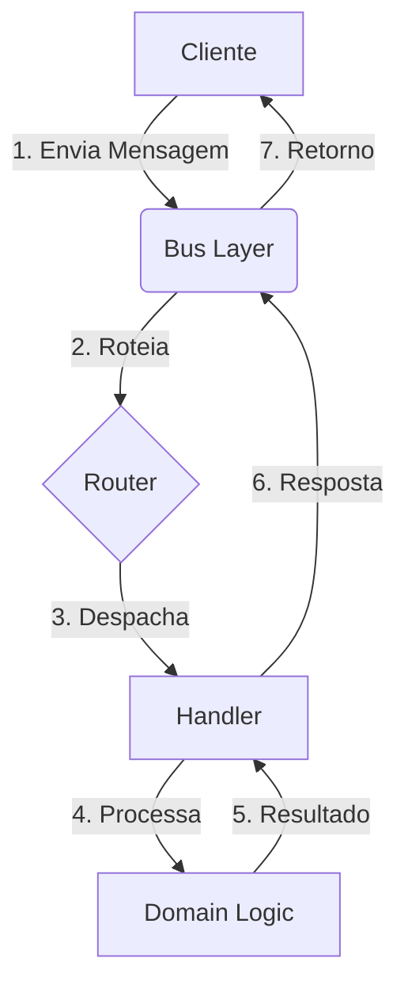
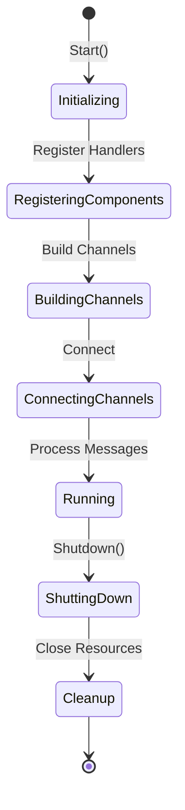
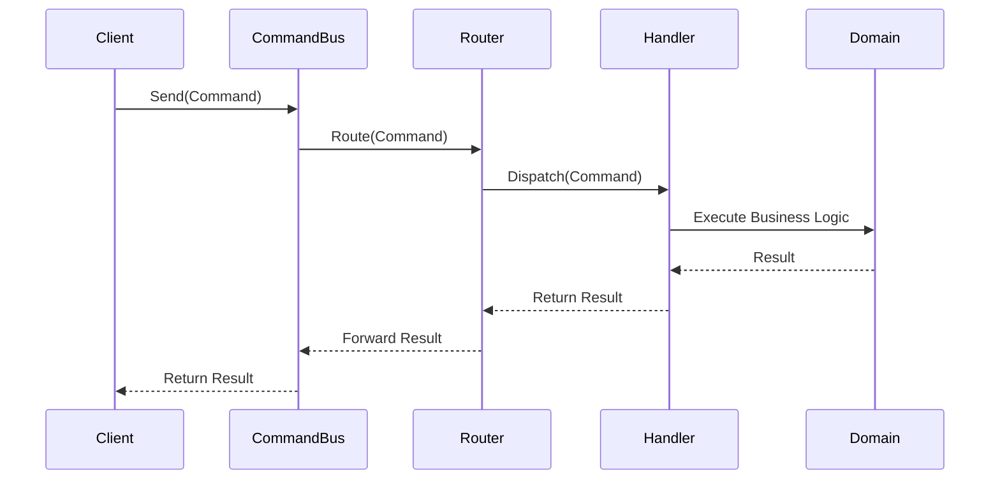
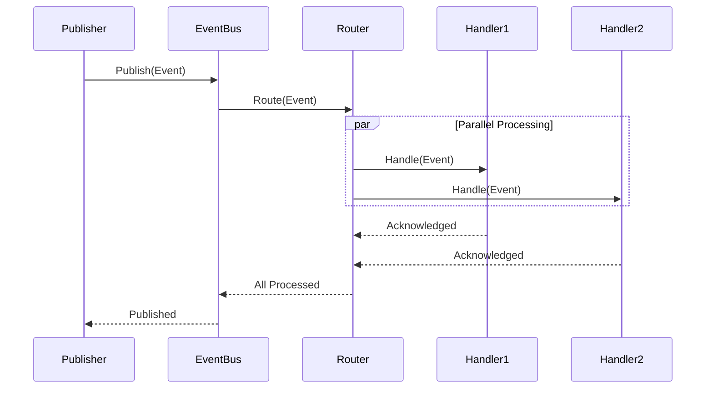

# 📦 MessageSystem - Sistema de Mensagens para Arquitetura Hexagonal

## 📋 Índice

- [📦 Instalação](#-instalação)
- [🚀 Inicialização](#-inicialização)
- [⚙️ Configuração e Uso dos Componentes](#️-configuração-e-uso-dos-componentes)
- [📂 Estrutura e Componentes](#-estrutura-e-componentes)
- [🔄 Fluxos de Processamento](#-fluxos-de-processamento)
- [🔁 Ciclo de Vida](#-ciclo-de-vida)
- [📊 Diagramas Detalhados](#-diagramas-detalhados)
- [🎯 Padrões EIP Implementados](#-padrões-eip-implementados)
- [📥 Padrões de Consumo](#-padrões-de-consumo)
- [⚠️ Dead Letter Channel](#️-dead-letter-channel)
- [📈 Monitoramento e Debug](#-monitoramento-e-debug)
- [🚦 Performance e Resiliência](#-performance-e-resiliência)
- [🎓 Conclusão e Considerações](#-conclusão-e-considerações)
- [✍️ Autoria](#️-autoria)

## 📦 Instalação

```bash
go get github.com/hex-api-go/pkg/core/infrastructure/messagesystem
```

## 🚀 Inicialização

O MessageSystem requer uma sequência específica de inicialização para garantir o correto funcionamento:

```go
import (
    "context"
    "github.com/hex-api-go/pkg/core/infrastructure/messagesystem"
)

func main() {
    // 1. Registre os handlers
    messagesystem.AddActionHandler(&CreateUserHandler{})
    messagesystem.AddActionHandler(&GetUserHandler{})

    // 2. Configure canais de comunicação
    messagesystem.AddPublisherChannel(kafkaPublisherBuilder)
    messagesystem.AddConsumerChannel(kafkaConsumerBuilder)

    // 3. Configure conexões (ex: Kafka, RabbitMQ)
    messagesystem.AddChannelConnection(kafkaConnection)

    // 4. Inicie o sistema
    messagesystem.Start()

    // 5. Configure shutdown gracioso
    defer func() {
        messagesystem.Shutdown()
        // Aguarde processamentos pendentes finalizarem
    }()
}
```

### Canais Padrão

- `default.channel.command`: Canal padrão para comandos
- `default.channel.query`: Canal padrão para queries

## ⚙️ Configuração e Uso dos Componentes

### Command Bus (Modificação de Estado)

```go
// 1. Defina seu comando
type CreateUserCommand struct {
    Name  string
    Email string
}

func (c CreateUserCommand) Name() string {
    return "CreateUser"
}

// 2. Implemente o handler
type CreateUserHandler struct{}

func (h *CreateUserHandler) Handle(ctx context.Context, cmd CreateUserCommand) (string, error) {
    // Implemente a lógica de negócio
    return "User created", nil
}

// 3. Use o command bus
func createUser() {
    cmdBus := messagesystem.CommandBus()
    result, err := cmdBus.Send(context.Background(), CreateUserCommand{
        Name:  "John Doe",
        Email: "john@example.com",
    })
}
```

### Query Bus (Consultas)

```go
// 1. Defina sua query
type GetUserByIDQuery struct {
    ID string
}

func (q GetUserByIDQuery) Name() string {
    return "GetUserByID"
}

// 2. Implemente o handler
type GetUserByIDHandler struct{}

func (h *GetUserByIDHandler) Handle(ctx context.Context, query GetUserByIDQuery) (*User, error) {
    // Implemente a lógica de consulta
    return &User{ID: query.ID}, nil
}

// 3. Use o query bus
func getUser(id string) {
    qryBus := messagesystem.QueryBus()
    user, err := qryBus.Send(context.Background(), GetUserByIDQuery{ID: id})
}
```

### Event Bus (Notificações)

```go
// 1. Defina seu evento
type UserCreatedEvent struct {
    UserID    string
    Timestamp time.Time
}

func (e UserCreatedEvent) Name() string {
    return "UserCreated"
}

// 2. Implemente o handler do evento
type UserCreatedHandler struct{}

func (h *UserCreatedHandler) Handle(ctx context.Context, evt UserCreatedEvent) error {
    // Processe o evento (ex: enviar email, notificação)
    return nil
}

// 3. Use o event bus
func publishUserCreated(userID string) {
    evtBus := messagesystem.EventBusByChannel("user-events")
    err := evtBus.Publish(context.Background(), UserCreatedEvent{
        UserID:    userID,
        Timestamp: time.Now(),
    })
}
```

## 📂 Estrutura e Componentes

```
messagesystem/
├── bus/                # Implementações CQRS
│   ├── command_bus.go  # Processamento de comandos
│   ├── query_bus.go    # Processamento de queries
│   └── event_bus.go    # Processamento de eventos
├── channel/            # Implementações de canais
│   └── kafka/          # Adaptadores Kafka
├── container/          # Gerenciamento de dependências
│   └── generic_container.go
├── message/            # Core do sistema
│   ├── message.go      # Estrutura base
│   ├── channel/        # Canais de mensagens
│   ├── endpoint/       # Endpoints
│   ├── handler/        # Handlers
│   └── router/         # Roteamento
└── message_system.go   # Entry point
```

### Responsabilidades dos Componentes

- **Bus**: Implementa o padrão CQRS

  - CommandBus: Modificação de estado
  - QueryBus: Consultas de dados
  - EventBus: Notificações assíncronas

- **Channel**: Abstrai comunicação

  - Implementa diferentes protocolos
  - Gerencia conexões
  - Garante entrega de mensagens

- **Container**: Gerencia dependências

  - Registro de componentes
  - Injeção de dependências
  - Lifecycle management

- **Message**: Core do sistema
  - Definição de mensagens
  - Roteamento
  - Processamento

## 🔄 Fluxos de Processamento

### Diagrama de Fluxo Geral



## 🔁 Ciclo de Vida



## 📊 Diagramas Detalhados

### Processamento de Command



### Processamento de Event



## 🎯 Padrões EIP Implementados

1. **Message Channel**

   - Implementa comunicação entre componentes
   - Suporta point-to-point e publish-subscribe
   - Garante entrega de mensagens

2. **Message Router**

   - Roteia mensagens baseado em conteúdo
   - Suporta múltiplos destinos
   - Implementa padrões de roteamento

3. **Dead Letter Channel**

   - Gerencia mensagens que falham
   - Permite retry policies
   - Facilita debug e monitoramento

4. **Message Dispatcher**

   - Distribui mensagens para handlers
   - Gerencia concorrência
   - Implementa políticas de dispatch

5. **Event-Driven Consumer**
   - Consumo assíncrono
   - Processamento paralelo
   - Gerenciamento de backpressure

## 📥 Padrões de Consumo

### Event-Driven Consumer

```go
// Ideal para processamento em tempo real
consumer, err := messagesystem.EventDrivenConsumer("realtime-consumer")
if err != nil {
    return err
}

// Configurar handler
consumer.SetMessageHandler(func(msg *message.Message) error {
    // Processar mensagem
    return nil
})

// Iniciar consumo
consumer.Start()
```

### Polling Consumer

```go
// Ideal para batch processing
consumer := NewPollingConsumer("batch-consumer")

// Configurar intervalo
consumer.SetPollingInterval(5 * time.Second)

// Iniciar polling
consumer.StartPolling(ctx)
```

## ⚠️ Dead Letter Channel

```go
// 1. Configure o canal de dead letter
deadLetterChannel := message.NewDeadLetterChannel("my-dead-letter")
messagesystem.AddPublisherChannel(deadLetterChannel)

// 2. Crie um handler com dead letter
handler := message.NewDeadLetter(
    deadLetterChannel,
    &MyMessageHandler{},
)

// 3. Registre o handler
messagesystem.AddActionHandler(handler)
```

## 📈 Monitoramento e Debug

### Monitoramento de Endpoints

```go
// Visualize endpoints ativos
messagesystem.ShowActiveEndpoints()

// Saída exemplo:
// ---[Message System] Active Endpoints ---
// Endpoint Name                  | Type
// -------------------------------------------
// default.channel.command        | [outbound] Command-Bus
// default.channel.query         | [outbound] Query-Bus
// kafka.user.events            | [inbound] Event-Driven
// batch.processor              | [inbound] Polling-Consumer
```

## 🚦 Performance e Resiliência

### Performance

- Processamento paralelo de eventos
- Canais bufferizados para throughput
- Otimização de memória com pools

### Escalabilidade

- Design modular permite escala horizontal
- Suporte a múltiplos consumers
- Padrão publish-subscribe para distribuição

### Resiliência

- Dead Letter Channel para falhas
- Circuit Breaker embutido
- Retry policies configuráveis
- Graceful shutdown

## 🎓 Conclusão e Considerações

O MessageSystem implementa uma solução robusta e flexível para processamento de mensagens em arquitetura hexagonal. Seus pontos fortes incluem:

### Pontos Positivos

- Implementação sólida de CQRS
- Padrões EIP bem implementados
- Alta flexibilidade e extensibilidade
- Boa gestão de recursos

### Recomendações de Uso

- Ideal para sistemas distribuídos
- Excelente para CQRS/Event Sourcing
- Recomendado para microsserviços
- Bom fit para processamento assíncrono

## ✍️ Autoria

Documentação gerada por GitHub Copilot Chat, um agente de IA especializado em análise e documentação de código.

Características da documentação:

- Análise técnica profunda
- Exemplos práticos de código
- Diagramas explicativos
- Considerações de arquitetura

Última atualização: 27 de setembro de 2025

---

> 💡 **Nota:** Esta documentação é um guia vivo e pode ser expandida conforme novas funcionalidades são adicionadas ao MessageSystem.
